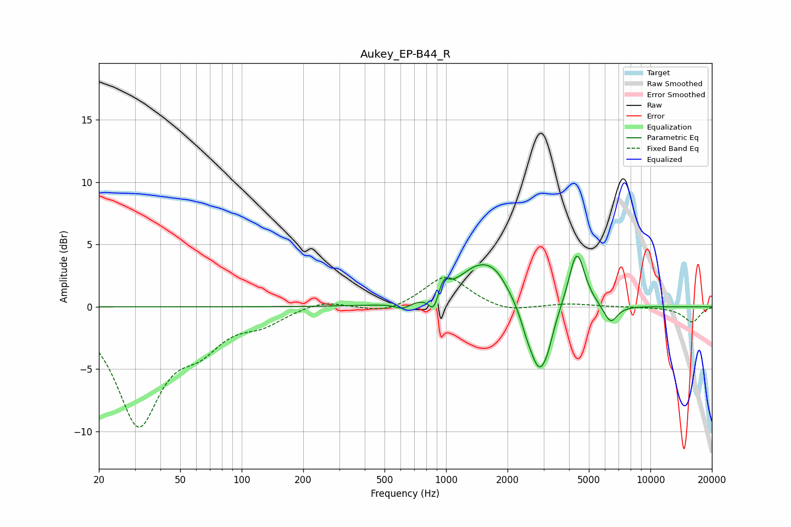

# Aukey_EP-B44_R
See [usage instructions](https://github.com/jaakkopasanen/AutoEq#usage) for more options and info.

### Parametric EQs
Apply preamp of -4.2 dB when using parametric equalizer.

|   # | Type    |   Fc (Hz) |    Q |   Gain (dB) |
|-----|---------|-----------|------|-------------|
|   1 | Peaking |       614 | 3.7  |        -0.5 |
|   2 | Peaking |       869 | 6    |        -1.4 |
|   3 | Peaking |       973 | 6    |         1.1 |
|   4 | Peaking |      1489 | 1.22 |         3.4 |
|   5 | Peaking |      1766 | 2.76 |         0.6 |
|   6 | Peaking |      2476 | 4.65 |        -0.8 |
|   7 | Peaking |      2866 | 2.81 |        -5.6 |
|   8 | Peaking |      3163 | 6    |        -0.7 |
|   9 | Peaking |      4363 | 3.55 |         4.7 |
|  10 | Peaking |      6383 | 4    |        -1.5 |

### Fixed Band EQs
When using fixed band (also called graphic) equalizer, apply preamp of **-2.4 dB** (if available) and set gains manually with these parameters.

|   # | Type    |   Fc (Hz) |    Q |   Gain (dB) |
|-----|---------|-----------|------|-------------|
|   1 | Peaking |        31 | 1.41 |        -9.2 |
|   2 | Peaking |        62 | 1.41 |        -2.4 |
|   3 | Peaking |       125 | 1.41 |        -1.1 |
|   4 | Peaking |       250 | 1.41 |         0.6 |
|   5 | Peaking |       500 | 1.41 |        -0.6 |
|   6 | Peaking |      1000 | 1.41 |         2.5 |
|   7 | Peaking |      2000 | 1.41 |        -0.5 |
|   8 | Peaking |      4000 | 1.41 |         0.2 |
|   9 | Peaking |      8000 | 1.41 |        -0   |
|  10 | Peaking |     16000 | 1.41 |        -1.2 |

### Graphs

