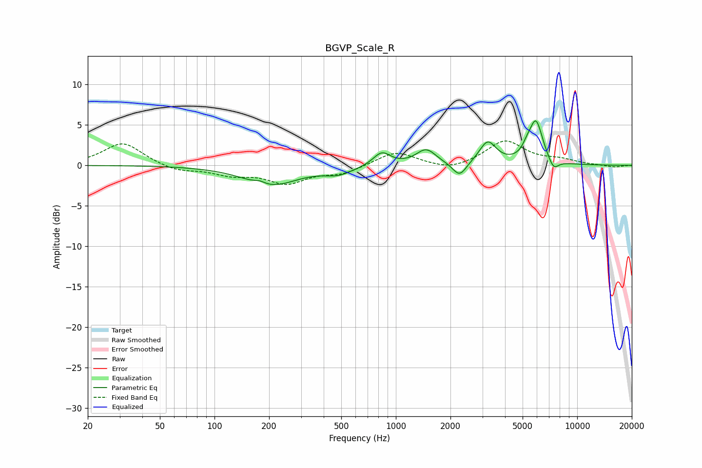

# BGVP_Scale_R
See [usage instructions](https://github.com/jaakkopasanen/AutoEq#usage) for more options and info.

### Parametric EQs
Apply preamp of -5.6 dB when using parametric equalizer.

|   # | Type    |   Fc (Hz) |    Q |   Gain (dB) |
|-----|---------|-----------|------|-------------|
|   1 | Peaking |       178 | 4.69 |         0.4 |
|   2 | Peaking |       205 | 0.96 |        -2.4 |
|   3 | Peaking |       483 | 1.88 |        -0.9 |
|   4 | Peaking |       837 | 3.02 |         1.7 |
|   5 | Peaking |      1470 | 2.6  |         1.9 |
|   6 | Peaking |      2245 | 3.7  |        -1.8 |
|   7 | Peaking |      3209 | 3.04 |         2.8 |
|   8 | Peaking |      5255 | 6    |         0.7 |
|   9 | Peaking |      5916 | 3.61 |         5.3 |
|  10 | Peaking |      7400 | 4.77 |        -1.3 |

### Fixed Band EQs
When using fixed band (also called graphic) equalizer, apply preamp of **-3.1 dB** (if available) and set gains manually with these parameters.

|   # | Type    |   Fc (Hz) |    Q |   Gain (dB) |
|-----|---------|-----------|------|-------------|
|   1 | Peaking |        31 | 1.41 |         2.8 |
|   2 | Peaking |        62 | 1.41 |        -0.8 |
|   3 | Peaking |       125 | 1.41 |        -1   |
|   4 | Peaking |       250 | 1.41 |        -2.1 |
|   5 | Peaking |       500 | 1.41 |        -1   |
|   6 | Peaking |      1000 | 1.41 |         1.7 |
|   7 | Peaking |      2000 | 1.41 |        -0.7 |
|   8 | Peaking |      4000 | 1.41 |         3   |
|   9 | Peaking |      8000 | 1.41 |         0.6 |
|  10 | Peaking |     16000 | 1.41 |        -0.2 |

### Graphs

