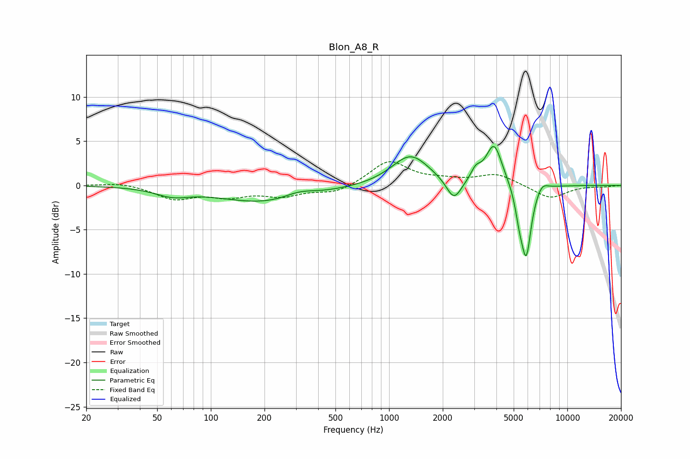

# Blon_A8_R
See [usage instructions](https://github.com/jaakkopasanen/AutoEq#usage) for more options and info.

### Parametric EQs
Apply preamp of -4.5 dB when using parametric equalizer.

|   # | Type    |   Fc (Hz) |    Q |   Gain (dB) |
|-----|---------|-----------|------|-------------|
|   1 | Peaking |        61 | 1.51 |        -0.9 |
|   2 | Peaking |       207 | 0.53 |        -2   |
|   3 | Peaking |       314 | 1.56 |         0.8 |
|   4 | Peaking |      1319 | 1.35 |         3.5 |
|   5 | Peaking |      2312 | 3.33 |        -2.5 |
|   6 | Peaking |      3064 | 5.09 |         1.2 |
|   7 | Peaking |      3881 | 3.07 |         4.7 |
|   8 | Peaking |      5382 | 5.99 |        -2.3 |
|   9 | Peaking |      5882 | 4.89 |        -7.8 |
|  10 | Peaking |      7220 | 4.2  |         0.9 |

### Fixed Band EQs
When using fixed band (also called graphic) equalizer, apply preamp of **-2.8 dB** (if available) and set gains manually with these parameters.

|   # | Type    |   Fc (Hz) |    Q |   Gain (dB) |
|-----|---------|-----------|------|-------------|
|   1 | Peaking |        31 | 1.41 |         0.4 |
|   2 | Peaking |        62 | 1.41 |        -1.5 |
|   3 | Peaking |       125 | 1.41 |        -1.1 |
|   4 | Peaking |       250 | 1.41 |        -1.1 |
|   5 | Peaking |       500 | 1.41 |        -0.9 |
|   6 | Peaking |      1000 | 1.41 |         2.8 |
|   7 | Peaking |      2000 | 1.41 |         0.4 |
|   8 | Peaking |      4000 | 1.41 |         1.3 |
|   9 | Peaking |      8000 | 1.41 |        -1.5 |
|  10 | Peaking |     16000 | 1.41 |        -0.1 |

### Graphs

