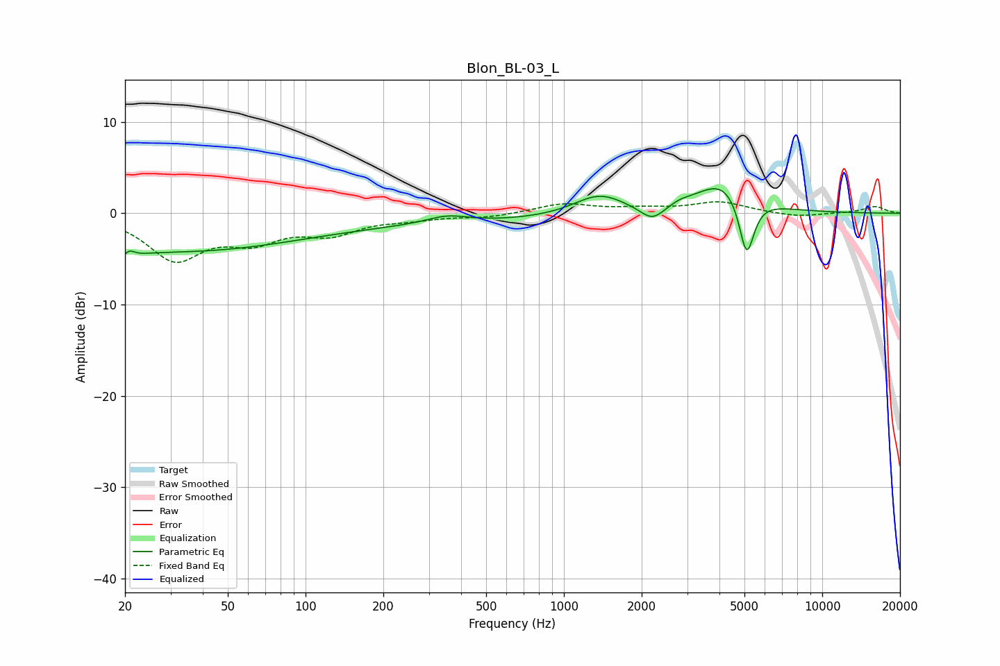

# Blon_BL-03_L
See [usage instructions](https://github.com/jaakkopasanen/AutoEq#usage) for more options and info.

### Parametric EQs
Apply preamp of -2.8 dB when using parametric equalizer.

|   # | Type    |   Fc (Hz) |    Q |   Gain (dB) |
|-----|---------|-----------|------|-------------|
|   1 | Peaking |        20 | 4    |        -3.8 |
|   2 | Peaking |        20 | 5.14 |         3.4 |
|   3 | Peaking |        26 | 0.28 |        -3.8 |
|   4 | Peaking |       224 | 0.2  |        -1.1 |
|   5 | Peaking |       353 | 1.68 |         0.9 |
|   6 | Peaking |      1369 | 1.44 |         2.2 |
|   7 | Peaking |      2200 | 2.96 |        -1.7 |
|   8 | Peaking |      2804 | 3.47 |         0.4 |
|   9 | Peaking |      4182 | 1.31 |         3.7 |
|  10 | Peaking |      5097 | 4.66 |        -6.8 |

### Fixed Band EQs
When using fixed band (also called graphic) equalizer, apply preamp of **-1.4 dB** (if available) and set gains manually with these parameters.

|   # | Type    |   Fc (Hz) |    Q |   Gain (dB) |
|-----|---------|-----------|------|-------------|
|   1 | Peaking |        31 | 1.41 |        -4.8 |
|   2 | Peaking |        62 | 1.41 |        -2.5 |
|   3 | Peaking |       125 | 1.41 |        -2   |
|   4 | Peaking |       250 | 1.41 |        -0.5 |
|   5 | Peaking |       500 | 1.41 |        -0.4 |
|   6 | Peaking |      1000 | 1.41 |         1   |
|   7 | Peaking |      2000 | 1.41 |         0.4 |
|   8 | Peaking |      4000 | 1.41 |         1.2 |
|   9 | Peaking |      8000 | 1.41 |        -0.4 |
|  10 | Peaking |     16000 | 1.41 |         0.7 |

### Graphs

