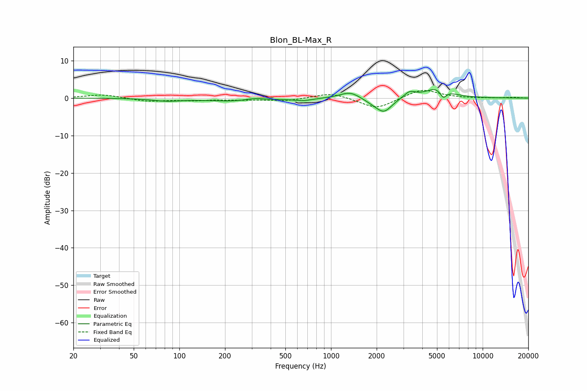

# Blon_BL-Max_R
See [usage instructions](https://github.com/jaakkopasanen/AutoEq#usage) for more options and info.

### Parametric EQs
Apply preamp of -2.3 dB when using parametric equalizer.

|   # | Type    |   Fc (Hz) |    Q |   Gain (dB) |
|-----|---------|-----------|------|-------------|
|   1 | Peaking |        83 | 1.54 |        -0.7 |
|   2 | Peaking |       241 | 0.75 |        -0.9 |
|   3 | Peaking |       314 | 2.18 |         0.7 |
|   4 | Peaking |       656 | 2.41 |        -0.6 |
|   5 | Peaking |      1337 | 2.13 |         1.9 |
|   6 | Peaking |      1880 | 2.22 |        -0.8 |
|   7 | Peaking |      2236 | 2.65 |        -3.6 |
|   8 | Peaking |      3294 | 3.7  |         1.7 |
|   9 | Peaking |      5090 | 1.81 |         3   |
|  10 | Peaking |      5495 | 6    |        -2.5 |

### Fixed Band EQs
When using fixed band (also called graphic) equalizer, apply preamp of **-2.1 dB** (if available) and set gains manually with these parameters.

|   # | Type    |   Fc (Hz) |    Q |   Gain (dB) |
|-----|---------|-----------|------|-------------|
|   1 | Peaking |        31 | 1.41 |         1   |
|   2 | Peaking |        62 | 1.41 |        -0.9 |
|   3 | Peaking |       125 | 1.41 |        -0.5 |
|   4 | Peaking |       250 | 1.41 |        -0.4 |
|   5 | Peaking |       500 | 1.41 |        -0.7 |
|   6 | Peaking |      1000 | 1.41 |         1.5 |
|   7 | Peaking |      2000 | 1.41 |        -3   |
|   8 | Peaking |      4000 | 1.41 |         2.5 |
|   9 | Peaking |      8000 | 1.41 |        -0   |
|  10 | Peaking |     16000 | 1.41 |         0.2 |

### Graphs

