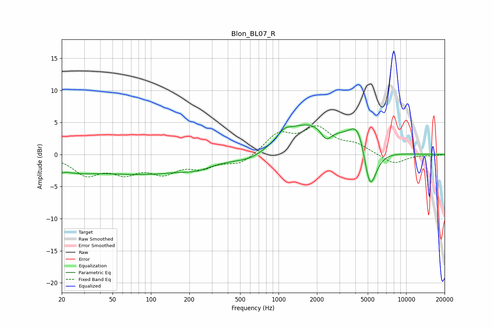

# Blon_BL07_R
See [usage instructions](https://github.com/jaakkopasanen/AutoEq#usage) for more options and info.

### Parametric EQs
Apply preamp of -4.7 dB when using parametric equalizer.

|   # | Type    |   Fc (Hz) |    Q |   Gain (dB) |
|-----|---------|-----------|------|-------------|
|   1 | Peaking |        20 | 5.94 |        -0.5 |
|   2 | Peaking |        25 | 1.02 |        -1.4 |
|   3 | Peaking |        86 | 0.31 |        -2.9 |
|   4 | Peaking |       230 | 1.43 |        -0.7 |
|   5 | Peaking |       618 | 1.01 |        -1.4 |
|   6 | Peaking |      1109 | 2.86 |         1.1 |
|   7 | Peaking |      1725 | 0.62 |         4.9 |
|   8 | Peaking |      2364 | 3.48 |        -1.9 |
|   9 | Peaking |      4231 | 2.02 |         4.8 |
|  10 | Peaking |      5188 | 2.64 |        -7.9 |

### Fixed Band EQs
When using fixed band (also called graphic) equalizer, apply preamp of **-4.6 dB** (if available) and set gains manually with these parameters.

|   # | Type    |   Fc (Hz) |    Q |   Gain (dB) |
|-----|---------|-----------|------|-------------|
|   1 | Peaking |        31 | 1.41 |        -2.9 |
|   2 | Peaking |        62 | 1.41 |        -2.4 |
|   3 | Peaking |       125 | 1.41 |        -2.5 |
|   4 | Peaking |       250 | 1.41 |        -1.7 |
|   5 | Peaking |       500 | 1.41 |        -1.5 |
|   6 | Peaking |      1000 | 1.41 |         3.1 |
|   7 | Peaking |      2000 | 1.41 |         3.8 |
|   8 | Peaking |      4000 | 1.41 |         1.3 |
|   9 | Peaking |      8000 | 1.41 |        -1.5 |
|  10 | Peaking |     16000 | 1.41 |        -0.2 |

### Graphs

