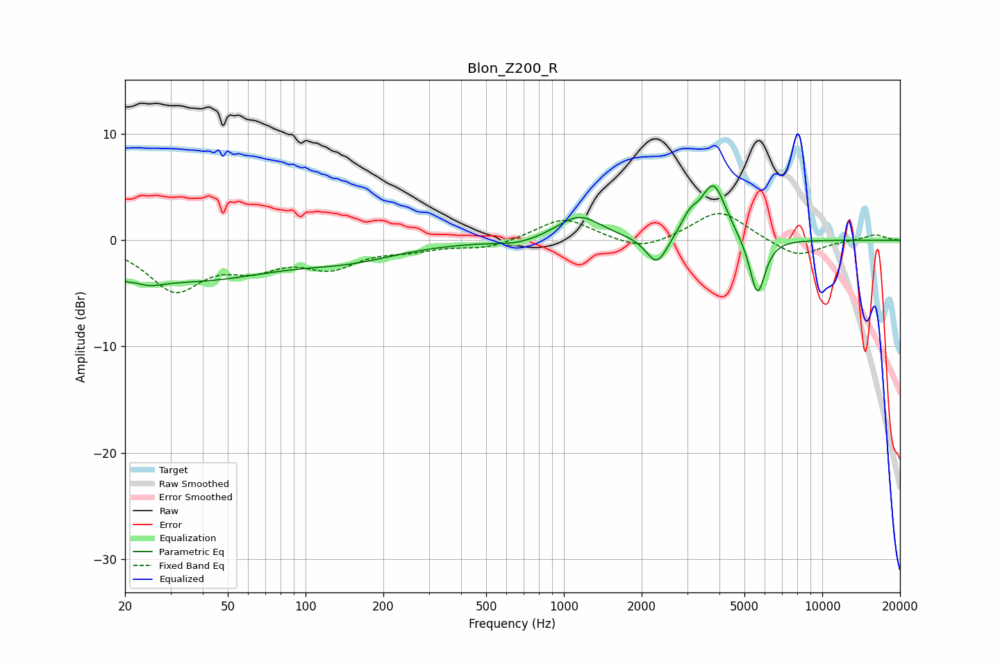

# Blon_Z200_R
See [usage instructions](https://github.com/jaakkopasanen/AutoEq#usage) for more options and info.

### Parametric EQs
Apply preamp of -5.2 dB when using parametric equalizer.

|   # | Type    |   Fc (Hz) |    Q |   Gain (dB) |
|-----|---------|-----------|------|-------------|
|   1 | Peaking |        22 | 2.31 |        -4.1 |
|   2 | Peaking |        22 | 3.04 |         2.8 |
|   3 | Peaking |        38 | 0.46 |        -3.4 |
|   4 | Peaking |       150 | 0.73 |        -1.3 |
|   5 | Peaking |       664 | 1.68 |        -0.5 |
|   6 | Peaking |      1145 | 1.67 |         2.3 |
|   7 | Peaking |      2291 | 3.44 |        -2.8 |
|   8 | Peaking |      3063 | 4.22 |         1.5 |
|   9 | Peaking |      3796 | 2.86 |         5.3 |
|  10 | Peaking |      5610 | 4.52 |        -5.6 |

### Fixed Band EQs
When using fixed band (also called graphic) equalizer, apply preamp of **-2.6 dB** (if available) and set gains manually with these parameters.

|   # | Type    |   Fc (Hz) |    Q |   Gain (dB) |
|-----|---------|-----------|------|-------------|
|   1 | Peaking |        31 | 1.41 |        -4.5 |
|   2 | Peaking |        62 | 1.41 |        -2   |
|   3 | Peaking |       125 | 1.41 |        -2.3 |
|   4 | Peaking |       250 | 1.41 |        -0.7 |
|   5 | Peaking |       500 | 1.41 |        -0.8 |
|   6 | Peaking |      1000 | 1.41 |         2.2 |
|   7 | Peaking |      2000 | 1.41 |        -1.1 |
|   8 | Peaking |      4000 | 1.41 |         2.9 |
|   9 | Peaking |      8000 | 1.41 |        -1.6 |
|  10 | Peaking |     16000 | 1.41 |         0.6 |

### Graphs

