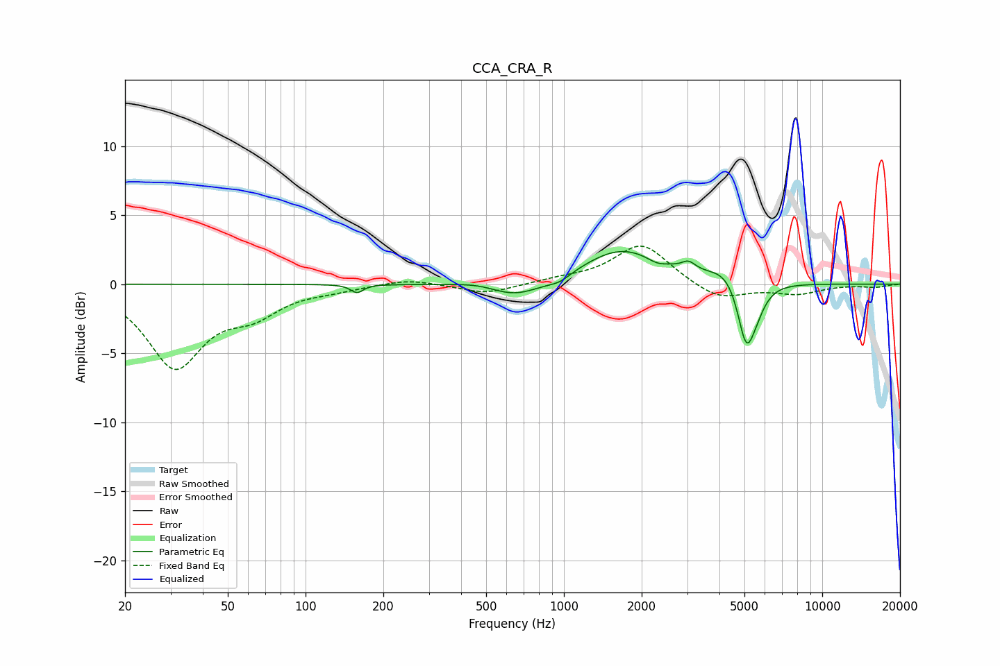

# CCA_CRA_R
See [usage instructions](https://github.com/jaakkopasanen/AutoEq#usage) for more options and info.

### Parametric EQs
Apply preamp of -2.5 dB when using parametric equalizer.

|   # | Type    |   Fc (Hz) |    Q |   Gain (dB) |
|-----|---------|-----------|------|-------------|
|   1 | Peaking |       158 | 6    |        -0.6 |
|   2 | Peaking |       480 | 1.47 |         0.4 |
|   3 | Peaking |       644 | 1.22 |        -1.3 |
|   4 | Peaking |       963 | 3.19 |        -0.4 |
|   5 | Peaking |      1668 | 0.91 |         2.6 |
|   6 | Peaking |      2287 | 3.92 |        -0.3 |
|   7 | Peaking |      3040 | 5.21 |         0.6 |
|   8 | Peaking |      4314 | 2    |         1.1 |
|   9 | Peaking |      5078 | 4.12 |        -4.6 |
|  10 | Peaking |      5573 | 3.62 |        -1.1 |

### Fixed Band EQs
When using fixed band (also called graphic) equalizer, apply preamp of **-2.9 dB** (if available) and set gains manually with these parameters.

|   # | Type    |   Fc (Hz) |    Q |   Gain (dB) |
|-----|---------|-----------|------|-------------|
|   1 | Peaking |        31 | 1.41 |        -5.8 |
|   2 | Peaking |        62 | 1.41 |        -1.8 |
|   3 | Peaking |       125 | 1.41 |        -0.3 |
|   4 | Peaking |       250 | 1.41 |         0.4 |
|   5 | Peaking |       500 | 1.41 |        -0.7 |
|   6 | Peaking |      1000 | 1.41 |         0.3 |
|   7 | Peaking |      2000 | 1.41 |         2.9 |
|   8 | Peaking |      4000 | 1.41 |        -1.2 |
|   9 | Peaking |      8000 | 1.41 |        -0.7 |
|  10 | Peaking |     16000 | 1.41 |        -0.2 |

### Graphs

