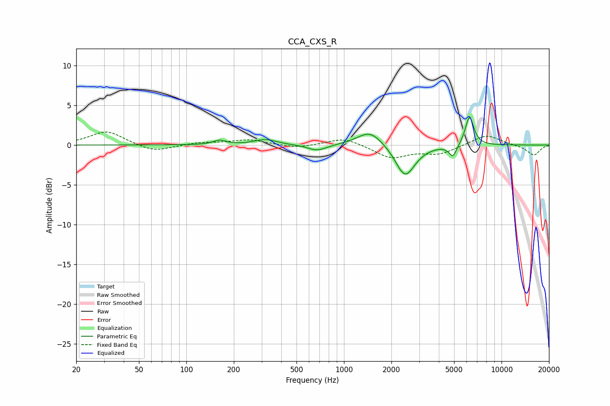

# CCA_CXS_R
See [usage instructions](https://github.com/jaakkopasanen/AutoEq#usage) for more options and info.

### Parametric EQs
Apply preamp of -3.5 dB when using parametric equalizer.

|   # | Type    |   Fc (Hz) |    Q |   Gain (dB) |
|-----|---------|-----------|------|-------------|
|   1 | Peaking |        64 | 1.69 |         0   |
|   2 | Peaking |       162 | 3.63 |         0.5 |
|   3 | Peaking |       317 | 2.04 |         0.7 |
|   4 | Peaking |       676 | 2.32 |        -0.8 |
|   5 | Peaking |      1447 | 1.56 |         0.3 |
|   6 | Peaking |      1464 | 1.82 |         1.6 |
|   7 | Peaking |      2430 | 2.42 |        -3.5 |
|   8 | Peaking |      2633 | 1.87 |        -0.5 |
|   9 | Peaking |      4910 | 5.9  |        -1.5 |
|  10 | Peaking |      6262 | 5.13 |         3.7 |

### Fixed Band EQs
When using fixed band (also called graphic) equalizer, apply preamp of **-1.7 dB** (if available) and set gains manually with these parameters.

|   # | Type    |   Fc (Hz) |    Q |   Gain (dB) |
|-----|---------|-----------|------|-------------|
|   1 | Peaking |        31 | 1.41 |         1.8 |
|   2 | Peaking |        62 | 1.41 |        -0.9 |
|   3 | Peaking |       125 | 1.41 |         0.3 |
|   4 | Peaking |       250 | 1.41 |         0.7 |
|   5 | Peaking |       500 | 1.41 |        -0.4 |
|   6 | Peaking |      1000 | 1.41 |         1   |
|   7 | Peaking |      2000 | 1.41 |        -1.6 |
|   8 | Peaking |      4000 | 1.41 |        -1.1 |
|   9 | Peaking |      8000 | 1.41 |         1.3 |
|  10 | Peaking |     16000 | 1.41 |        -1.3 |

### Graphs

