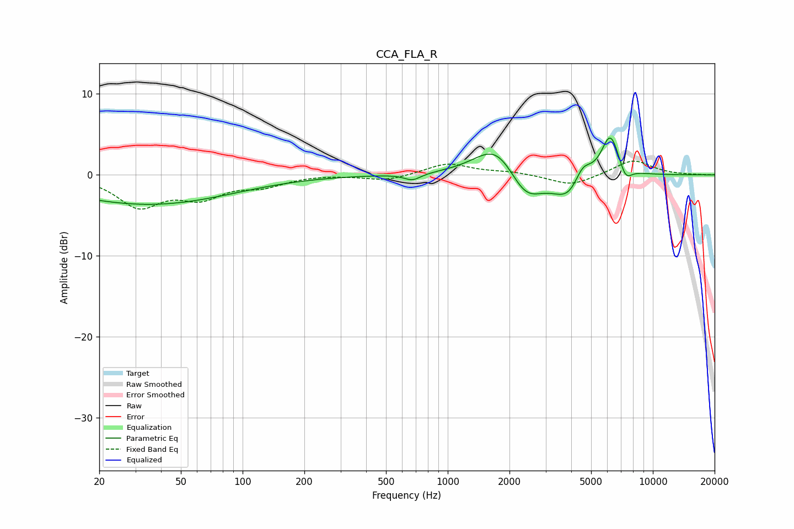

# CCA_FLA_R
See [usage instructions](https://github.com/jaakkopasanen/AutoEq#usage) for more options and info.

### Parametric EQs
Apply preamp of -4.6 dB when using parametric equalizer.

|   # | Type    |   Fc (Hz) |    Q |   Gain (dB) |
|-----|---------|-----------|------|-------------|
|   1 | Peaking |        25 | 0.42 |        -2.6 |
|   2 | Peaking |        26 | 2.46 |         0   |
|   3 | Peaking |        61 | 0.47 |        -1.6 |
|   4 | Peaking |       673 | 3.51 |        -0.8 |
|   5 | Peaking |      1730 | 1.32 |         4.2 |
|   6 | Peaking |      2394 | 1.71 |        -3.7 |
|   7 | Peaking |      3976 | 1.72 |        -3.6 |
|   8 | Peaking |      4531 | 3.14 |         2.8 |
|   9 | Peaking |      6206 | 3.03 |         5.4 |
|  10 | Peaking |      7355 | 4.49 |        -1.8 |

### Fixed Band EQs
When using fixed band (also called graphic) equalizer, apply preamp of **-1.8 dB** (if available) and set gains manually with these parameters.

|   # | Type    |   Fc (Hz) |    Q |   Gain (dB) |
|-----|---------|-----------|------|-------------|
|   1 | Peaking |        31 | 1.41 |        -3.7 |
|   2 | Peaking |        62 | 1.41 |        -2.5 |
|   3 | Peaking |       125 | 1.41 |        -1.2 |
|   4 | Peaking |       250 | 1.41 |         0.1 |
|   5 | Peaking |       500 | 1.41 |        -0.7 |
|   6 | Peaking |      1000 | 1.41 |         1.4 |
|   7 | Peaking |      2000 | 1.41 |         0.3 |
|   8 | Peaking |      4000 | 1.41 |        -1.4 |
|   9 | Peaking |      8000 | 1.41 |         1.9 |
|  10 | Peaking |     16000 | 1.41 |        -0   |

### Graphs

