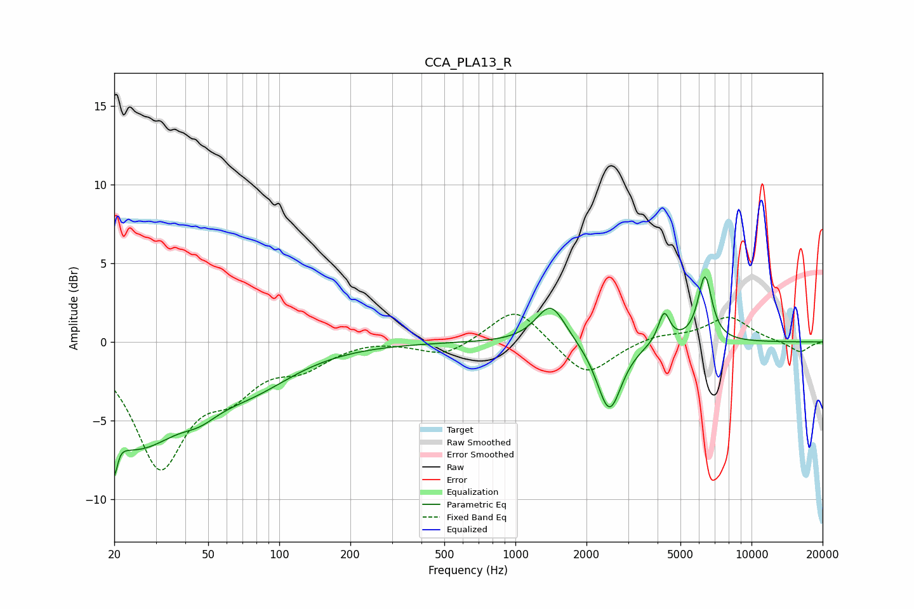

# CCA_PLA13_R
See [usage instructions](https://github.com/jaakkopasanen/AutoEq#usage) for more options and info.

### Parametric EQs
Apply preamp of -4.3 dB when using parametric equalizer.

|   # | Type    |   Fc (Hz) |    Q |   Gain (dB) |
|-----|---------|-----------|------|-------------|
|   1 | Peaking |        20 | 5.67 |        -5.9 |
|   2 | Peaking |        20 | 5.68 |         3.4 |
|   3 | Peaking |        25 | 0.72 |        -6   |
|   4 | Peaking |        46 | 1.83 |        -0.9 |
|   5 | Peaking |        76 | 0.74 |        -2.1 |
|   6 | Peaking |      1413 | 2.29 |         2.5 |
|   7 | Peaking |      2486 | 2.1  |        -0.6 |
|   8 | Peaking |      2500 | 2.82 |        -3.9 |
|   9 | Peaking |      4263 | 5.74 |         2   |
|  10 | Peaking |      6348 | 4.67 |         4.2 |

### Fixed Band EQs
When using fixed band (also called graphic) equalizer, apply preamp of **-1.9 dB** (if available) and set gains manually with these parameters.

|   # | Type    |   Fc (Hz) |    Q |   Gain (dB) |
|-----|---------|-----------|------|-------------|
|   1 | Peaking |        31 | 1.41 |        -7.7 |
|   2 | Peaking |        62 | 1.41 |        -2.4 |
|   3 | Peaking |       125 | 1.41 |        -1.3 |
|   4 | Peaking |       250 | 1.41 |         0.2 |
|   5 | Peaking |       500 | 1.41 |        -0.9 |
|   6 | Peaking |      1000 | 1.41 |         2.3 |
|   7 | Peaking |      2000 | 1.41 |        -2.3 |
|   8 | Peaking |      4000 | 1.41 |         0.4 |
|   9 | Peaking |      8000 | 1.41 |         1.6 |
|  10 | Peaking |     16000 | 1.41 |        -0.7 |

### Graphs

