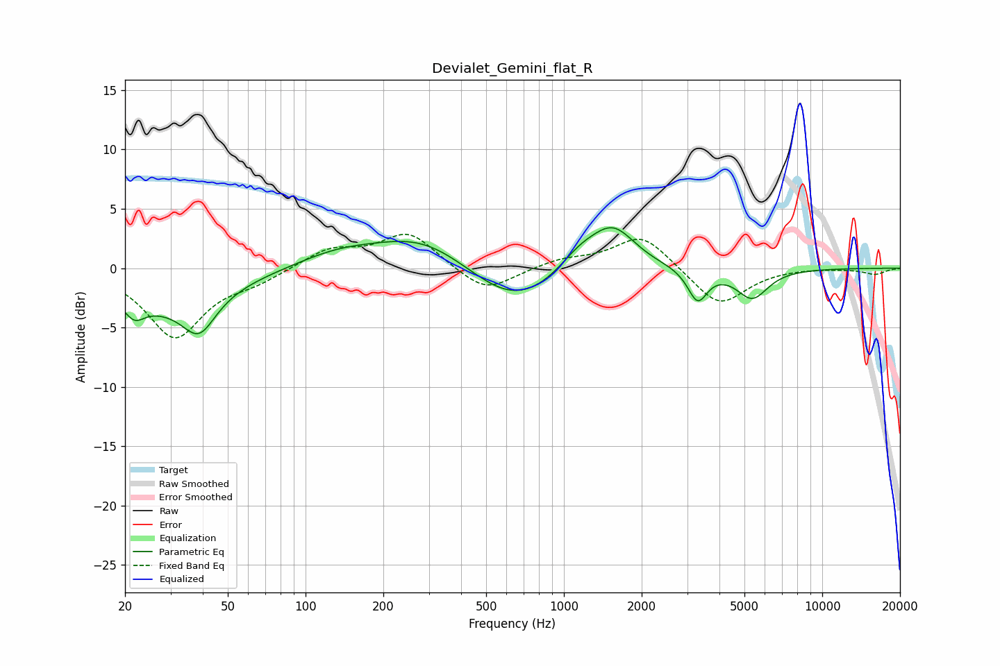

# Devialet_Gemini_flat_R
See [usage instructions](https://github.com/jaakkopasanen/AutoEq#usage) for more options and info.

### Parametric EQs
Apply preamp of -3.5 dB when using parametric equalizer.

|   # | Type    |   Fc (Hz) |    Q |   Gain (dB) |
|-----|---------|-----------|------|-------------|
|   1 | Peaking |        22 | 3.63 |        -1.5 |
|   2 | Peaking |        29 | 0.63 |        -2.9 |
|   3 | Peaking |        39 | 2.27 |        -3.1 |
|   4 | Peaking |       132 | 0.89 |         1.1 |
|   5 | Peaking |       286 | 0.73 |         2.9 |
|   6 | Peaking |       644 | 0.78 |        -3.6 |
|   7 | Peaking |      1147 | 1.7  |         1.7 |
|   8 | Peaking |      1549 | 1.59 |         3.6 |
|   9 | Peaking |      3292 | 3.77 |        -2.7 |
|  10 | Peaking |      5359 | 2.28 |        -2.5 |

### Fixed Band EQs
When using fixed band (also called graphic) equalizer, apply preamp of **-2.9 dB** (if available) and set gains manually with these parameters.

|   # | Type    |   Fc (Hz) |    Q |   Gain (dB) |
|-----|---------|-----------|------|-------------|
|   1 | Peaking |        31 | 1.41 |        -5.8 |
|   2 | Peaking |        62 | 1.41 |        -0.9 |
|   3 | Peaking |       125 | 1.41 |         1.6 |
|   4 | Peaking |       250 | 1.41 |         3   |
|   5 | Peaking |       500 | 1.41 |        -2.2 |
|   6 | Peaking |      1000 | 1.41 |         0.7 |
|   7 | Peaking |      2000 | 1.41 |         2.9 |
|   8 | Peaking |      4000 | 1.41 |        -3.3 |
|   9 | Peaking |      8000 | 1.41 |         0.1 |
|  10 | Peaking |     16000 | 1.41 |        -0.5 |

### Graphs

