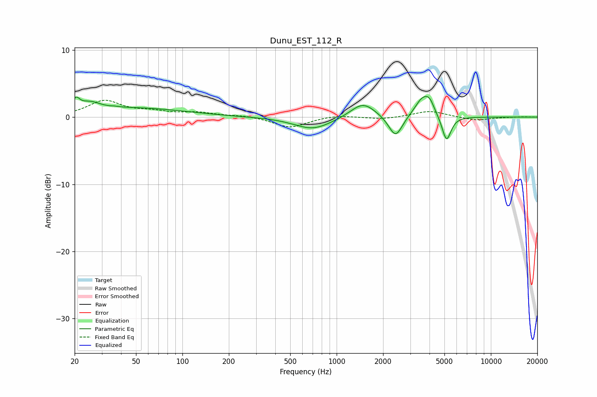

# Dunu_EST_112_R
See [usage instructions](https://github.com/jaakkopasanen/AutoEq#usage) for more options and info.

### Parametric EQs
Apply preamp of -3.2 dB when using parametric equalizer.

|   # | Type    |   Fc (Hz) |    Q |   Gain (dB) |
|-----|---------|-----------|------|-------------|
|   1 | Peaking |        20 | 5.94 |         1.6 |
|   2 | Peaking |        25 | 2.16 |         1.3 |
|   3 | Peaking |        37 | 5.77 |         0.1 |
|   4 | Peaking |        50 | 0.44 |         1.3 |
|   5 | Peaking |       702 | 1.17 |        -1.8 |
|   6 | Peaking |      1482 | 1.76 |         2.3 |
|   7 | Peaking |      2410 | 3.18 |        -3.3 |
|   8 | Peaking |      3615 | 2.72 |         2.8 |
|   9 | Peaking |      4016 | 4.78 |         1.4 |
|  10 | Peaking |      5158 | 4.81 |        -3.8 |

### Fixed Band EQs
When using fixed band (also called graphic) equalizer, apply preamp of **-2.6 dB** (if available) and set gains manually with these parameters.

|   # | Type    |   Fc (Hz) |    Q |   Gain (dB) |
|-----|---------|-----------|------|-------------|
|   1 | Peaking |        31 | 1.41 |         2.4 |
|   2 | Peaking |        62 | 1.41 |         0.7 |
|   3 | Peaking |       125 | 1.41 |         0.6 |
|   4 | Peaking |       250 | 1.41 |         0.2 |
|   5 | Peaking |       500 | 1.41 |        -1.6 |
|   6 | Peaking |      1000 | 1.41 |         0.3 |
|   7 | Peaking |      2000 | 1.41 |        -0.3 |
|   8 | Peaking |      4000 | 1.41 |         0.9 |
|   9 | Peaking |      8000 | 1.41 |        -0.5 |
|  10 | Peaking |     16000 | 1.41 |         0.1 |

### Graphs

