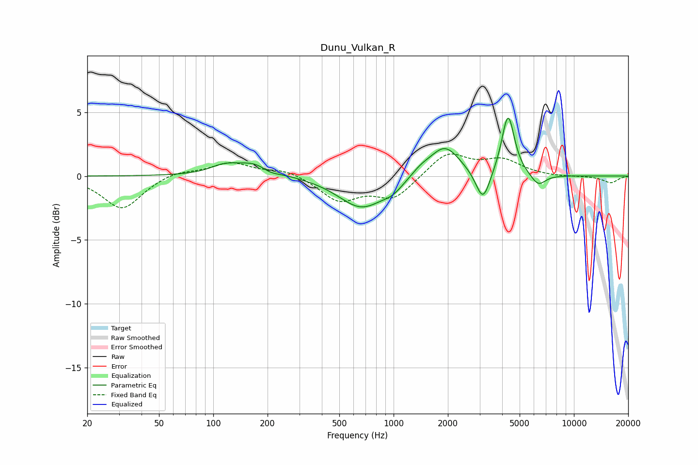

# Dunu_Vulkan_R
See [usage instructions](https://github.com/jaakkopasanen/AutoEq#usage) for more options and info.

### Parametric EQs
Apply preamp of -4.6 dB when using parametric equalizer.

|   # | Type    |   Fc (Hz) |    Q |   Gain (dB) |
|-----|---------|-----------|------|-------------|
|   1 | Peaking |       115 | 1.76 |         0.6 |
|   2 | Peaking |       178 | 1.4  |         1.2 |
|   3 | Peaking |       204 | 2.39 |        -0.6 |
|   4 | Peaking |       666 | 1.1  |        -2.5 |
|   5 | Peaking |       991 | 2.57 |        -0.6 |
|   6 | Peaking |      1414 | 2.66 |         0.5 |
|   7 | Peaking |      1922 | 1.68 |         2.4 |
|   8 | Peaking |      3130 | 3.62 |        -2.5 |
|   9 | Peaking |      4313 | 4.01 |         4.8 |
|  10 | Peaking |      6338 | 3.37 |        -0.9 |

### Fixed Band EQs
When using fixed band (also called graphic) equalizer, apply preamp of **-1.8 dB** (if available) and set gains manually with these parameters.

|   # | Type    |   Fc (Hz) |    Q |   Gain (dB) |
|-----|---------|-----------|------|-------------|
|   1 | Peaking |        31 | 1.41 |        -2.6 |
|   2 | Peaking |        62 | 1.41 |         0.4 |
|   3 | Peaking |       125 | 1.41 |         1   |
|   4 | Peaking |       250 | 1.41 |         0.5 |
|   5 | Peaking |       500 | 1.41 |        -1.9 |
|   6 | Peaking |      1000 | 1.41 |        -1.7 |
|   7 | Peaking |      2000 | 1.41 |         1.9 |
|   8 | Peaking |      4000 | 1.41 |         1.2 |
|   9 | Peaking |      8000 | 1.41 |        -0.1 |
|  10 | Peaking |     16000 | 1.41 |        -0.5 |

### Graphs

