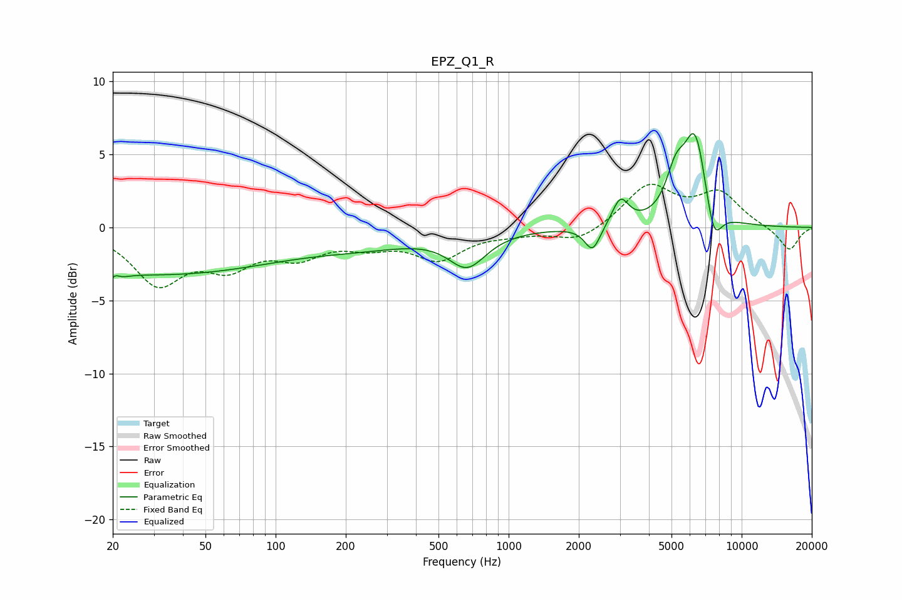

# EPZ_Q1_R
See [usage instructions](https://github.com/jaakkopasanen/AutoEq#usage) for more options and info.

### Parametric EQs
Apply preamp of -6.5 dB when using parametric equalizer.

|   # | Type    |   Fc (Hz) |    Q |   Gain (dB) |
|-----|---------|-----------|------|-------------|
|   1 | Peaking |        20 | 4.82 |        -3.2 |
|   2 | Peaking |        20 | 5.78 |         2.8 |
|   3 | Peaking |        32 | 0.26 |        -3.1 |
|   4 | Peaking |       248 | 0.58 |        -0.9 |
|   5 | Peaking |       664 | 1.76 |        -2.3 |
|   6 | Peaking |      2292 | 4.26 |        -1.7 |
|   7 | Peaking |      3017 | 4.04 |         1.8 |
|   8 | Peaking |      5209 | 3.34 |         2.6 |
|   9 | Peaking |      6325 | 2.73 |         6.2 |
|  10 | Peaking |      7580 | 3.83 |        -2.8 |

### Fixed Band EQs
When using fixed band (also called graphic) equalizer, apply preamp of **-3.1 dB** (if available) and set gains manually with these parameters.

|   # | Type    |   Fc (Hz) |    Q |   Gain (dB) |
|-----|---------|-----------|------|-------------|
|   1 | Peaking |        31 | 1.41 |        -3.6 |
|   2 | Peaking |        62 | 1.41 |        -2.2 |
|   3 | Peaking |       125 | 1.41 |        -1.7 |
|   4 | Peaking |       250 | 1.41 |        -1   |
|   5 | Peaking |       500 | 1.41 |        -2   |
|   6 | Peaking |      1000 | 1.41 |        -0.3 |
|   7 | Peaking |      2000 | 1.41 |        -1   |
|   8 | Peaking |      4000 | 1.41 |         2.8 |
|   9 | Peaking |      8000 | 1.41 |         2.2 |
|  10 | Peaking |     16000 | 1.41 |        -1.6 |

### Graphs

