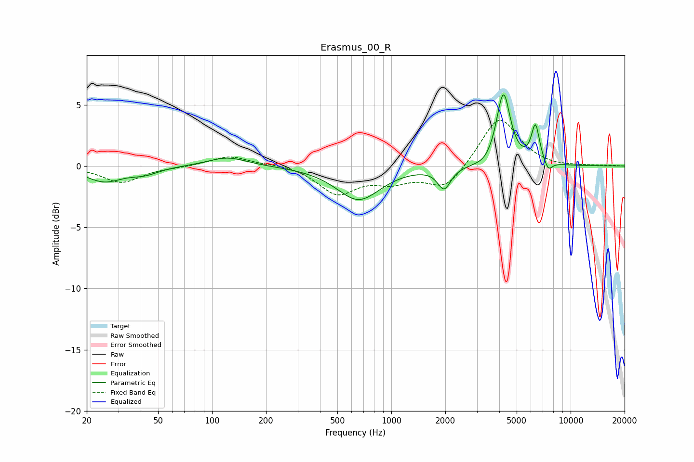

# Erasmus_00_R
See [usage instructions](https://github.com/jaakkopasanen/AutoEq#usage) for more options and info.

### Parametric EQs
Apply preamp of -5.9 dB when using parametric equalizer.

|   # | Type    |   Fc (Hz) |    Q |   Gain (dB) |
|-----|---------|-----------|------|-------------|
|   1 | Peaking |        25 | 1.38 |        -1.2 |
|   2 | Peaking |        42 | 1.83 |        -0.5 |
|   3 | Peaking |       122 | 1.29 |         0.8 |
|   4 | Peaking |       656 | 1.17 |        -2.7 |
|   5 | Peaking |      1970 | 3.92 |        -1.7 |
|   6 | Peaking |      3357 | 2.72 |        -0.4 |
|   7 | Peaking |      4197 | 3.03 |         1.3 |
|   8 | Peaking |      4219 | 3.9  |         4.7 |
|   9 | Peaking |      6366 | 5.99 |         3.1 |
|  10 | Peaking |      7502 | 5.95 |        -0.8 |

### Fixed Band EQs
When using fixed band (also called graphic) equalizer, apply preamp of **-3.8 dB** (if available) and set gains manually with these parameters.

|   # | Type    |   Fc (Hz) |    Q |   Gain (dB) |
|-----|---------|-----------|------|-------------|
|   1 | Peaking |        31 | 1.41 |        -1.3 |
|   2 | Peaking |        62 | 1.41 |        -0.1 |
|   3 | Peaking |       125 | 1.41 |         0.8 |
|   4 | Peaking |       250 | 1.41 |         0.2 |
|   5 | Peaking |       500 | 1.41 |        -2.2 |
|   6 | Peaking |      1000 | 1.41 |        -1.1 |
|   7 | Peaking |      2000 | 1.41 |        -1.9 |
|   8 | Peaking |      4000 | 1.41 |         4.1 |
|   9 | Peaking |      8000 | 1.41 |        -0.1 |
|  10 | Peaking |     16000 | 1.41 |         0   |

### Graphs

