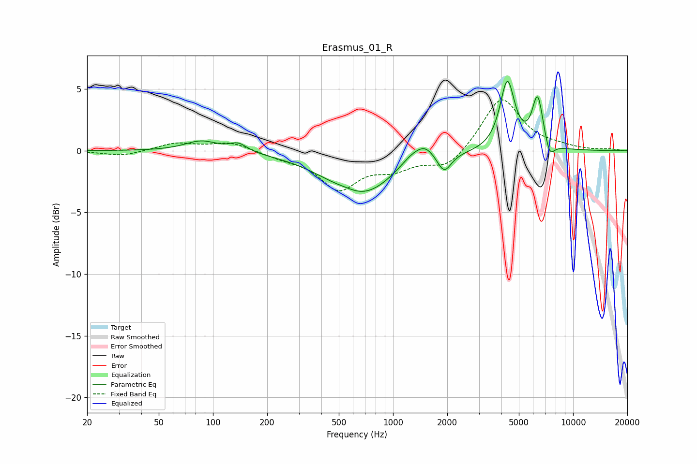

# Erasmus_01_R
See [usage instructions](https://github.com/jaakkopasanen/AutoEq#usage) for more options and info.

### Parametric EQs
Apply preamp of -5.7 dB when using parametric equalizer.

|   # | Type    |   Fc (Hz) |    Q |   Gain (dB) |
|-----|---------|-----------|------|-------------|
|   1 | Peaking |        86 | 1.55 |         0.8 |
|   2 | Peaking |       138 | 2.97 |         0.7 |
|   3 | Peaking |       551 | 2.23 |         0.3 |
|   4 | Peaking |       663 | 0.74 |        -3.6 |
|   5 | Peaking |      1302 | 1.81 |         1.2 |
|   6 | Peaking |      1522 | 2.94 |         0.8 |
|   7 | Peaking |      1924 | 3.73 |        -1.5 |
|   8 | Peaking |      4313 | 3.49 |         5.5 |
|   9 | Peaking |      6358 | 4.48 |         4.2 |
|  10 | Peaking |      7404 | 5.07 |        -1.3 |

### Fixed Band EQs
When using fixed band (also called graphic) equalizer, apply preamp of **-4.2 dB** (if available) and set gains manually with these parameters.

|   # | Type    |   Fc (Hz) |    Q |   Gain (dB) |
|-----|---------|-----------|------|-------------|
|   1 | Peaking |        31 | 1.41 |        -0.4 |
|   2 | Peaking |        62 | 1.41 |         0.6 |
|   3 | Peaking |       125 | 1.41 |         0.7 |
|   4 | Peaking |       250 | 1.41 |        -0.4 |
|   5 | Peaking |       500 | 1.41 |        -3   |
|   6 | Peaking |      1000 | 1.41 |        -1.2 |
|   7 | Peaking |      2000 | 1.41 |        -1.4 |
|   8 | Peaking |      4000 | 1.41 |         4.4 |
|   9 | Peaking |      8000 | 1.41 |         0.3 |
|  10 | Peaking |     16000 | 1.41 |         0.1 |

### Graphs

