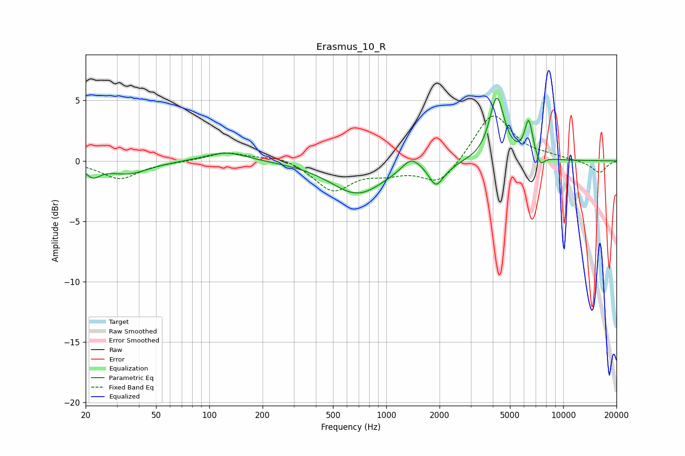

# Erasmus_10_R
See [usage instructions](https://github.com/jaakkopasanen/AutoEq#usage) for more options and info.

### Parametric EQs
Apply preamp of -5.3 dB when using parametric equalizer.

|   # | Type    |   Fc (Hz) |    Q |   Gain (dB) |
|-----|---------|-----------|------|-------------|
|   1 | Peaking |        22 | 3.33 |        -1   |
|   2 | Peaking |        35 | 1.2  |        -1   |
|   3 | Peaking |       125 | 1.2  |         0.8 |
|   4 | Peaking |       688 | 0.94 |        -2.7 |
|   5 | Peaking |      1382 | 2.82 |         1.1 |
|   6 | Peaking |      1907 | 3.69 |        -1.7 |
|   7 | Peaking |      2188 | 2.7  |        -0.3 |
|   8 | Peaking |      4217 | 3.39 |         5.2 |
|   9 | Peaking |      6380 | 6    |         3.1 |
|  10 | Peaking |      7422 | 5.84 |        -0.9 |

### Fixed Band EQs
When using fixed band (also called graphic) equalizer, apply preamp of **-3.8 dB** (if available) and set gains manually with these parameters.

|   # | Type    |   Fc (Hz) |    Q |   Gain (dB) |
|-----|---------|-----------|------|-------------|
|   1 | Peaking |        31 | 1.41 |        -1.5 |
|   2 | Peaking |        62 | 1.41 |        -0.1 |
|   3 | Peaking |       125 | 1.41 |         0.7 |
|   4 | Peaking |       250 | 1.41 |         0.4 |
|   5 | Peaking |       500 | 1.41 |        -2.4 |
|   6 | Peaking |      1000 | 1.41 |        -0.8 |
|   7 | Peaking |      2000 | 1.41 |        -2   |
|   8 | Peaking |      4000 | 1.41 |         4.1 |
|   9 | Peaking |      8000 | 1.41 |         0.3 |
|  10 | Peaking |     16000 | 1.41 |        -1   |

### Graphs

