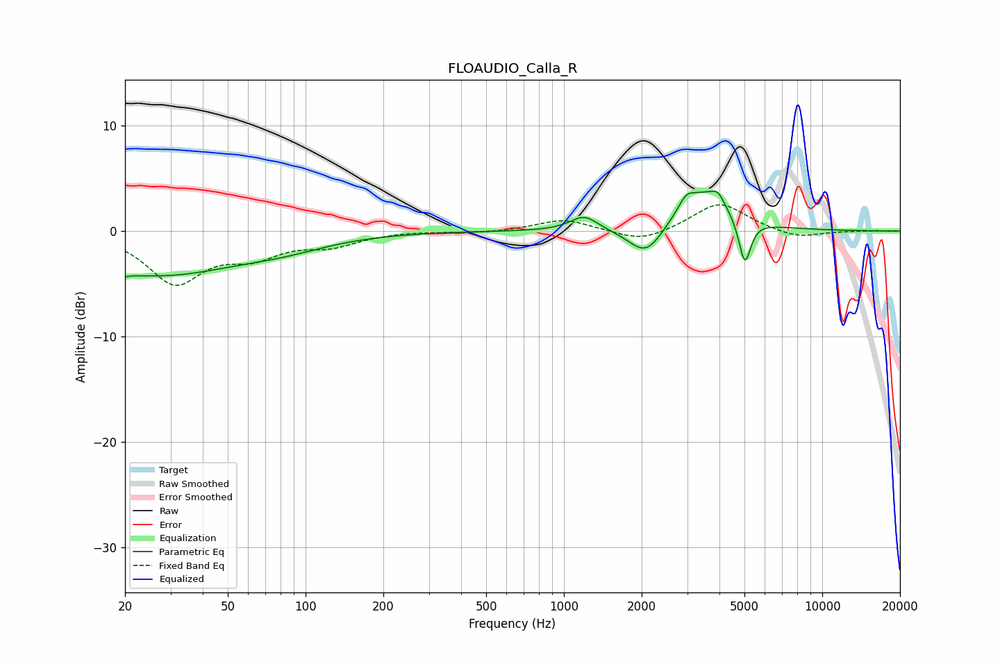

# FLOAUDIO_Calla_R
See [usage instructions](https://github.com/jaakkopasanen/AutoEq#usage) for more options and info.

### Parametric EQs
Apply preamp of -3.9 dB when using parametric equalizer.

|   # | Type    |   Fc (Hz) |    Q |   Gain (dB) |
|-----|---------|-----------|------|-------------|
|   1 | Peaking |        20 | 5.73 |        -3.7 |
|   2 | Peaking |        20 | 5.86 |         3.3 |
|   3 | Peaking |        26 | 0.45 |        -4.1 |
|   4 | Peaking |        83 | 0.8  |        -0.9 |
|   5 | Peaking |      1197 | 2.62 |         1.4 |
|   6 | Peaking |      2083 | 2.09 |        -3   |
|   7 | Peaking |      2970 | 5.13 |         1   |
|   8 | Peaking |      3435 | 1.38 |         3.8 |
|   9 | Peaking |      3946 | 5.78 |         1   |
|  10 | Peaking |      5015 | 6    |        -4.4 |

### Fixed Band EQs
When using fixed band (also called graphic) equalizer, apply preamp of **-2.6 dB** (if available) and set gains manually with these parameters.

|   # | Type    |   Fc (Hz) |    Q |   Gain (dB) |
|-----|---------|-----------|------|-------------|
|   1 | Peaking |        31 | 1.41 |        -4.7 |
|   2 | Peaking |        62 | 1.41 |        -2   |
|   3 | Peaking |       125 | 1.41 |        -1.2 |
|   4 | Peaking |       250 | 1.41 |         0   |
|   5 | Peaking |       500 | 1.41 |        -0.2 |
|   6 | Peaking |      1000 | 1.41 |         1.1 |
|   7 | Peaking |      2000 | 1.41 |        -1.1 |
|   8 | Peaking |      4000 | 1.41 |         2.7 |
|   9 | Peaking |      8000 | 1.41 |        -0.7 |
|  10 | Peaking |     16000 | 1.41 |         0   |

### Graphs

