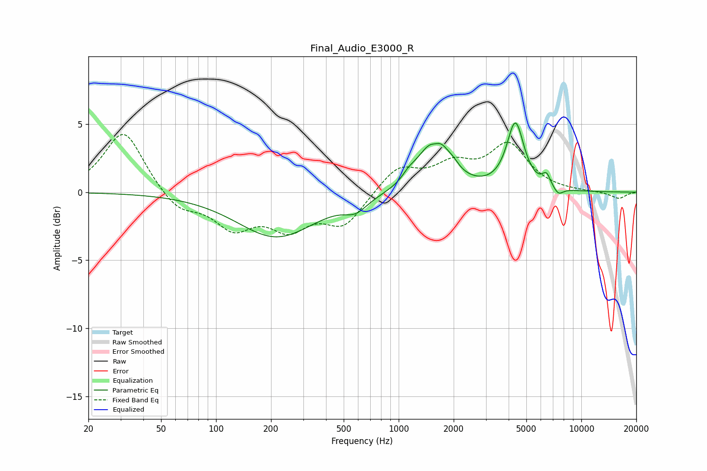

# Final_Audio_E3000_R
See [usage instructions](https://github.com/jaakkopasanen/AutoEq#usage) for more options and info.

### Parametric EQs
Apply preamp of -5.2 dB when using parametric equalizer.

|   # | Type    |   Fc (Hz) |    Q |   Gain (dB) |
|-----|---------|-----------|------|-------------|
|   1 | Peaking |       214 | 0.66 |        -3.3 |
|   2 | Peaking |       582 | 2.32 |        -0.9 |
|   3 | Peaking |      1126 | 4.79 |         0.3 |
|   4 | Peaking |      1268 | 2    |         0.7 |
|   5 | Peaking |      1585 | 5.27 |        -0.5 |
|   6 | Peaking |      1608 | 1.88 |         3.7 |
|   7 | Peaking |      2001 | 5.24 |         0.3 |
|   8 | Peaking |      4356 | 3.03 |         4.9 |
|   9 | Peaking |      6444 | 6    |         0.9 |
|  10 | Peaking |      7479 | 4.91 |        -0.6 |

### Fixed Band EQs
When using fixed band (also called graphic) equalizer, apply preamp of **-4.3 dB** (if available) and set gains manually with these parameters.

|   # | Type    |   Fc (Hz) |    Q |   Gain (dB) |
|-----|---------|-----------|------|-------------|
|   1 | Peaking |        31 | 1.41 |         4.6 |
|   2 | Peaking |        62 | 1.41 |        -1.4 |
|   3 | Peaking |       125 | 1.41 |        -2.4 |
|   4 | Peaking |       250 | 1.41 |        -2.3 |
|   5 | Peaking |       500 | 1.41 |        -2.3 |
|   6 | Peaking |      1000 | 1.41 |         1.8 |
|   7 | Peaking |      2000 | 1.41 |         1.7 |
|   8 | Peaking |      4000 | 1.41 |         3.3 |
|   9 | Peaking |      8000 | 1.41 |         0   |
|  10 | Peaking |     16000 | 1.41 |        -0.5 |

### Graphs

