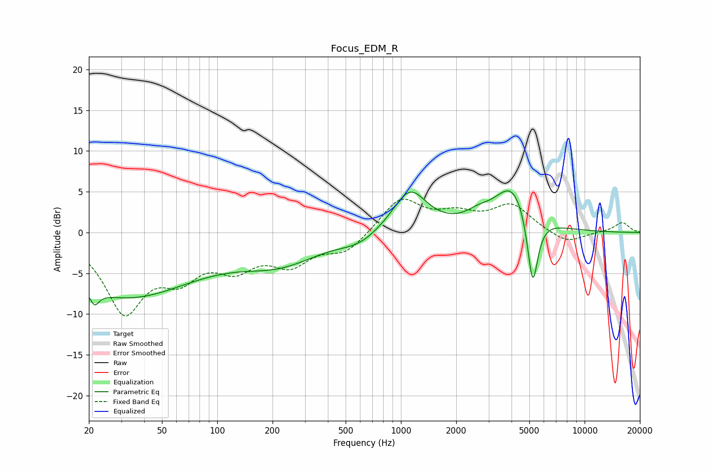

# Focus_EDM_R
See [usage instructions](https://github.com/jaakkopasanen/AutoEq#usage) for more options and info.

### Parametric EQs
Apply preamp of -5.2 dB when using parametric equalizer.

|   # | Type    |   Fc (Hz) |    Q |   Gain (dB) |
|-----|---------|-----------|------|-------------|
|   1 | Peaking |        22 | 5.78 |        -5   |
|   2 | Peaking |        22 | 5.87 |         3.2 |
|   3 | Peaking |        27 | 0.4  |         0.9 |
|   4 | Peaking |        32 | 0.37 |        -8.6 |
|   5 | Peaking |       221 | 0.65 |        -3.2 |
|   6 | Peaking |       593 | 1.39 |        -1.1 |
|   7 | Peaking |      1118 | 1.52 |         5.3 |
|   8 | Peaking |      2627 | 2.09 |         1   |
|   9 | Peaking |      4069 | 1.4  |         5.9 |
|  10 | Peaking |      5216 | 4.63 |        -9.4 |

### Fixed Band EQs
When using fixed band (also called graphic) equalizer, apply preamp of **-4.2 dB** (if available) and set gains manually with these parameters.

|   # | Type    |   Fc (Hz) |    Q |   Gain (dB) |
|-----|---------|-----------|------|-------------|
|   1 | Peaking |        31 | 1.41 |        -9.3 |
|   2 | Peaking |        62 | 1.41 |        -4.3 |
|   3 | Peaking |       125 | 1.41 |        -3.6 |
|   4 | Peaking |       250 | 1.41 |        -3.4 |
|   5 | Peaking |       500 | 1.41 |        -2.3 |
|   6 | Peaking |      1000 | 1.41 |         4.2 |
|   7 | Peaking |      2000 | 1.41 |         1.9 |
|   8 | Peaking |      4000 | 1.41 |         3.2 |
|   9 | Peaking |      8000 | 1.41 |        -1.4 |
|  10 | Peaking |     16000 | 1.41 |         1.2 |

### Graphs

