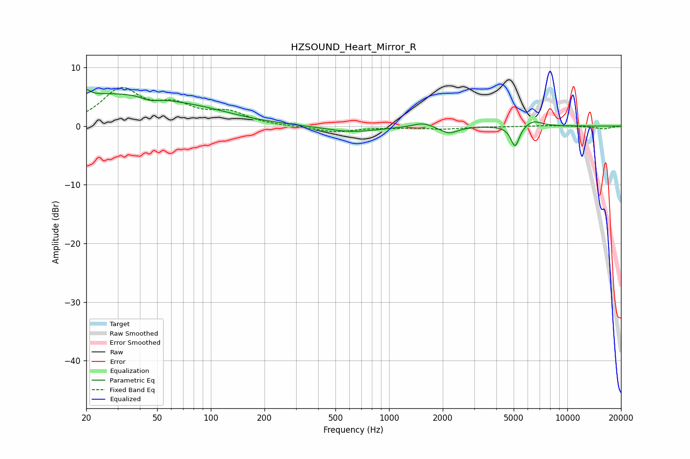

# HZSOUND_Heart_Mirror_R
See [usage instructions](https://github.com/jaakkopasanen/AutoEq#usage) for more options and info.

### Parametric EQs
Apply preamp of -6.3 dB when using parametric equalizer.

|   # | Type    |   Fc (Hz) |    Q |   Gain (dB) |
|-----|---------|-----------|------|-------------|
|   1 | Peaking |        20 | 6    |        -3.9 |
|   2 | Peaking |        20 | 6    |         5.1 |
|   3 | Peaking |        28 | 0.41 |         5.2 |
|   4 | Peaking |        46 | 3.35 |        -0.6 |
|   5 | Peaking |        92 | 0.67 |         1.3 |
|   6 | Peaking |       619 | 0.97 |        -1   |
|   7 | Peaking |      1549 | 2.57 |         0.8 |
|   8 | Peaking |      2160 | 2.87 |        -1.2 |
|   9 | Peaking |      5091 | 5.83 |        -3.6 |
|  10 | Peaking |      6432 | 2.78 |         1   |

### Fixed Band EQs
When using fixed band (also called graphic) equalizer, apply preamp of **-6.7 dB** (if available) and set gains manually with these parameters.

|   # | Type    |   Fc (Hz) |    Q |   Gain (dB) |
|-----|---------|-----------|------|-------------|
|   1 | Peaking |        31 | 1.41 |         6   |
|   2 | Peaking |        62 | 1.41 |         2.9 |
|   3 | Peaking |       125 | 1.41 |         2.1 |
|   4 | Peaking |       250 | 1.41 |        -0.1 |
|   5 | Peaking |       500 | 1.41 |        -1   |
|   6 | Peaking |      1000 | 1.41 |        -0.2 |
|   7 | Peaking |      2000 | 1.41 |        -0.4 |
|   8 | Peaking |      4000 | 1.41 |        -0.1 |
|   9 | Peaking |      8000 | 1.41 |         0.1 |
|  10 | Peaking |     16000 | 1.41 |        -0.5 |

### Graphs

