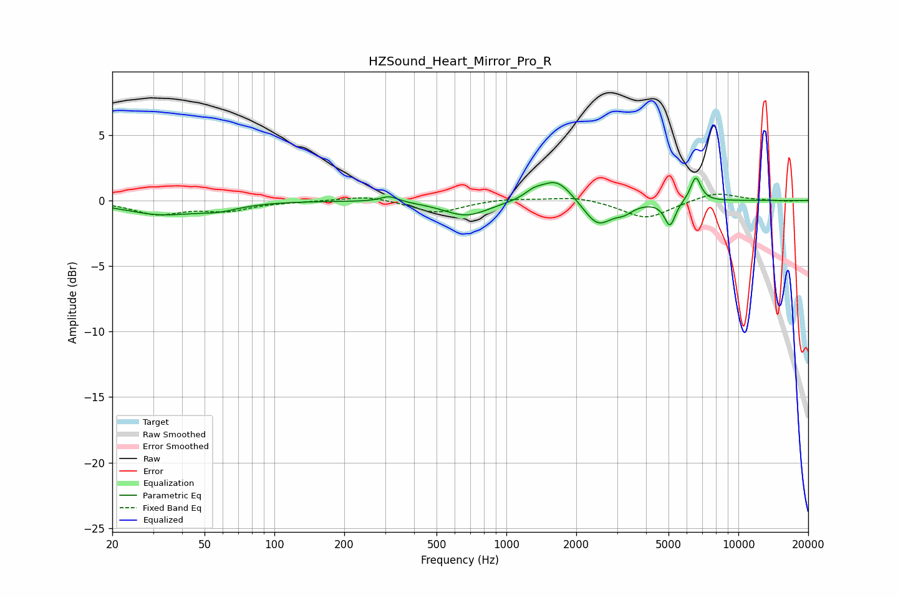

# HZSound_Heart_Mirror_Pro_R
See [usage instructions](https://github.com/jaakkopasanen/AutoEq#usage) for more options and info.

### Parametric EQs
Apply preamp of -1.8 dB when using parametric equalizer.

|   # | Type    |   Fc (Hz) |    Q |   Gain (dB) |
|-----|---------|-----------|------|-------------|
|   1 | Peaking |        32 | 0.91 |        -1   |
|   2 | Peaking |        57 | 1.59 |        -0.5 |
|   3 | Peaking |       313 | 3.69 |         0.5 |
|   4 | Peaking |       672 | 1.44 |        -1.2 |
|   5 | Peaking |      1311 | 3.69 |         0.5 |
|   6 | Peaking |      1647 | 2.03 |         1.8 |
|   7 | Peaking |      2475 | 2.28 |        -2   |
|   8 | Peaking |      3220 | 3.66 |        -0.5 |
|   9 | Peaking |      5070 | 6    |        -1.9 |
|  10 | Peaking |      6548 | 6    |         1.9 |

### Fixed Band EQs
When using fixed band (also called graphic) equalizer, apply preamp of **-0.6 dB** (if available) and set gains manually with these parameters.

|   # | Type    |   Fc (Hz) |    Q |   Gain (dB) |
|-----|---------|-----------|------|-------------|
|   1 | Peaking |        31 | 1.41 |        -1   |
|   2 | Peaking |        62 | 1.41 |        -0.7 |
|   3 | Peaking |       125 | 1.41 |        -0   |
|   4 | Peaking |       250 | 1.41 |         0.4 |
|   5 | Peaking |       500 | 1.41 |        -1   |
|   6 | Peaking |      1000 | 1.41 |         0.2 |
|   7 | Peaking |      2000 | 1.41 |         0.3 |
|   8 | Peaking |      4000 | 1.41 |        -1.4 |
|   9 | Peaking |      8000 | 1.41 |         0.7 |
|  10 | Peaking |     16000 | 1.41 |        -0.1 |

### Graphs

