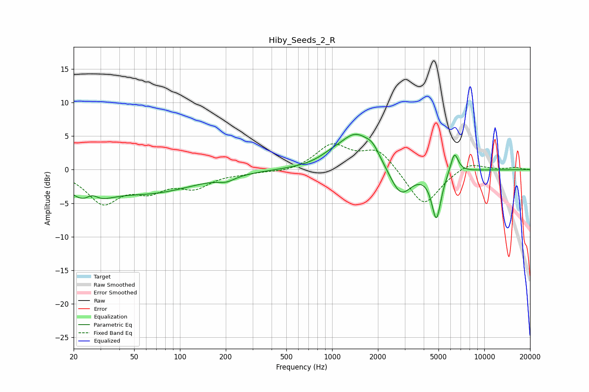

# Hiby_Seeds_2_R
See [usage instructions](https://github.com/jaakkopasanen/AutoEq#usage) for more options and info.

### Parametric EQs
Apply preamp of -5.3 dB when using parametric equalizer.

|   # | Type    |   Fc (Hz) |    Q |   Gain (dB) |
|-----|---------|-----------|------|-------------|
|   1 | Peaking |        25 | 1.21 |        -4   |
|   2 | Peaking |        26 | 3.36 |         1.6 |
|   3 | Peaking |        66 | 0.48 |        -3.1 |
|   4 | Peaking |       202 | 2.53 |        -0.7 |
|   5 | Peaking |       965 | 2.03 |         0.5 |
|   6 | Peaking |      1433 | 1.22 |         5.3 |
|   7 | Peaking |      1855 | 3.19 |         1.3 |
|   8 | Peaking |      2817 | 1.94 |        -4.5 |
|   9 | Peaking |      4843 | 4.49 |        -7.1 |
|  10 | Peaking |      6360 | 5.29 |         3.1 |

### Fixed Band EQs
When using fixed band (also called graphic) equalizer, apply preamp of **-4.0 dB** (if available) and set gains manually with these parameters.

|   # | Type    |   Fc (Hz) |    Q |   Gain (dB) |
|-----|---------|-----------|------|-------------|
|   1 | Peaking |        31 | 1.41 |        -4.7 |
|   2 | Peaking |        62 | 1.41 |        -2.6 |
|   3 | Peaking |       125 | 1.41 |        -2.3 |
|   4 | Peaking |       250 | 1.41 |        -0.4 |
|   5 | Peaking |       500 | 1.41 |        -0.5 |
|   6 | Peaking |      1000 | 1.41 |         3.6 |
|   7 | Peaking |      2000 | 1.41 |         3.1 |
|   8 | Peaking |      4000 | 1.41 |        -5.6 |
|   9 | Peaking |      8000 | 1.41 |         1.2 |
|  10 | Peaking |     16000 | 1.41 |         0.3 |

### Graphs

