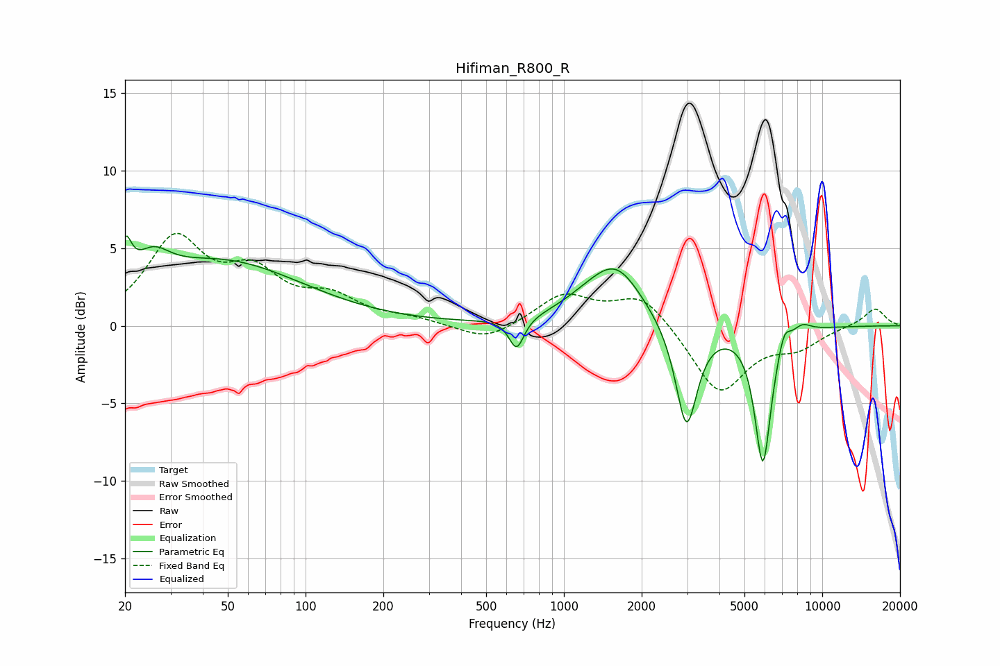

# Hifiman_R800_R
See [usage instructions](https://github.com/jaakkopasanen/AutoEq#usage) for more options and info.

### Parametric EQs
Apply preamp of -5.9 dB when using parametric equalizer.

|   # | Type    |   Fc (Hz) |    Q |   Gain (dB) |
|-----|---------|-----------|------|-------------|
|   1 | Peaking |        20 | 5.97 |         2.6 |
|   2 | Peaking |        26 | 2.21 |         1.8 |
|   3 | Peaking |        47 | 0.45 |         4.1 |
|   4 | Peaking |       656 | 4.92 |        -2   |
|   5 | Peaking |      1216 | 1.28 |         0.8 |
|   6 | Peaking |      1599 | 1.39 |         3.4 |
|   7 | Peaking |      2981 | 3.37 |        -6.9 |
|   8 | Peaking |      5893 | 4.33 |        -8.9 |
|   9 | Peaking |      7118 | 5.95 |         1.2 |
|  10 | Peaking |      8349 | 3.71 |         0.6 |

### Fixed Band EQs
When using fixed band (also called graphic) equalizer, apply preamp of **-6.0 dB** (if available) and set gains manually with these parameters.

|   # | Type    |   Fc (Hz) |    Q |   Gain (dB) |
|-----|---------|-----------|------|-------------|
|   1 | Peaking |        31 | 1.41 |         5.3 |
|   2 | Peaking |        62 | 1.41 |         2.9 |
|   3 | Peaking |       125 | 1.41 |         1.6 |
|   4 | Peaking |       250 | 1.41 |         0.4 |
|   5 | Peaking |       500 | 1.41 |        -1.1 |
|   6 | Peaking |      1000 | 1.41 |         2   |
|   7 | Peaking |      2000 | 1.41 |         2.1 |
|   8 | Peaking |      4000 | 1.41 |        -4.4 |
|   9 | Peaking |      8000 | 1.41 |        -1.2 |
|  10 | Peaking |     16000 | 1.41 |         1.2 |

### Graphs

