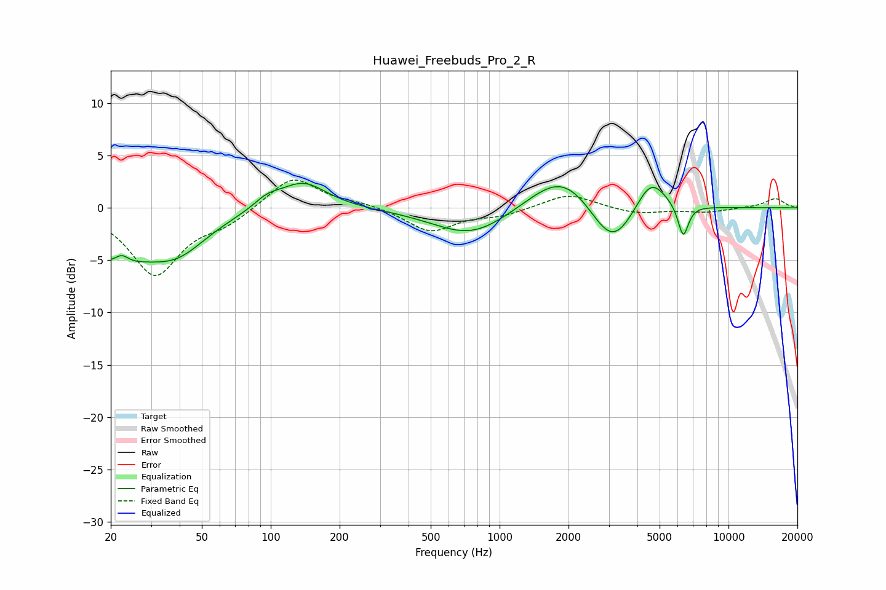

# Huawei_Freebuds_Pro_2_R
See [usage instructions](https://github.com/jaakkopasanen/AutoEq#usage) for more options and info.

### Parametric EQs
Apply preamp of -2.4 dB when using parametric equalizer.

|   # | Type    |   Fc (Hz) |    Q |   Gain (dB) |
|-----|---------|-----------|------|-------------|
|   1 | Peaking |        20 | 0.91 |        -4.4 |
|   2 | Peaking |        22 | 4.55 |         1   |
|   3 | Peaking |        39 | 1.05 |        -3.4 |
|   4 | Peaking |        96 | 2.41 |         0.9 |
|   5 | Peaking |       138 | 1.35 |         2.6 |
|   6 | Peaking |       755 | 0.84 |        -2.8 |
|   7 | Peaking |      1892 | 0.97 |         3.9 |
|   8 | Peaking |      3105 | 1.45 |        -4.8 |
|   9 | Peaking |      4574 | 2.06 |         3.3 |
|  10 | Peaking |      6339 | 5.99 |        -3.1 |

### Fixed Band EQs
When using fixed band (also called graphic) equalizer, apply preamp of **-2.7 dB** (if available) and set gains manually with these parameters.

|   # | Type    |   Fc (Hz) |    Q |   Gain (dB) |
|-----|---------|-----------|------|-------------|
|   1 | Peaking |        31 | 1.41 |        -6.3 |
|   2 | Peaking |        62 | 1.41 |        -1.3 |
|   3 | Peaking |       125 | 1.41 |         3.1 |
|   4 | Peaking |       250 | 1.41 |         0.4 |
|   5 | Peaking |       500 | 1.41 |        -2.3 |
|   6 | Peaking |      1000 | 1.41 |        -0.7 |
|   7 | Peaking |      2000 | 1.41 |         1.4 |
|   8 | Peaking |      4000 | 1.41 |        -0.6 |
|   9 | Peaking |      8000 | 1.41 |        -0.4 |
|  10 | Peaking |     16000 | 1.41 |         0.9 |

### Graphs

