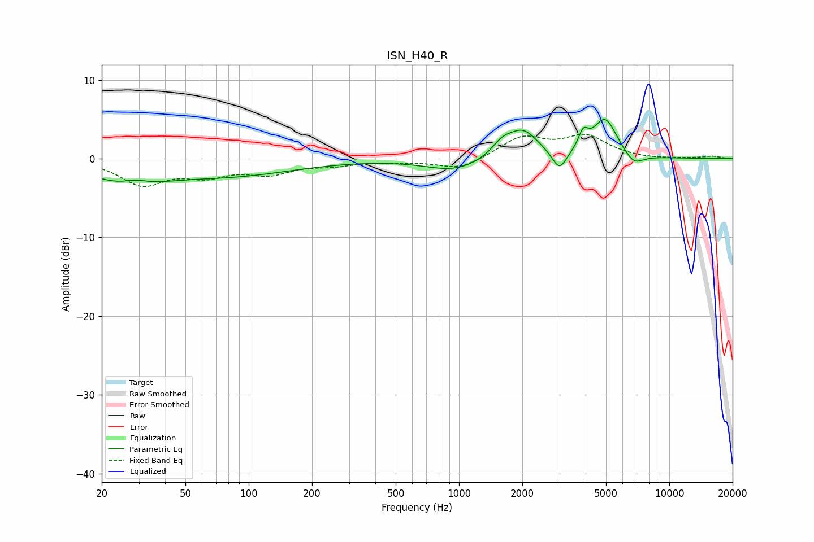

# ISN_H40_R
See [usage instructions](https://github.com/jaakkopasanen/AutoEq#usage) for more options and info.

### Parametric EQs
Apply preamp of -5.1 dB when using parametric equalizer.

|   # | Type    |   Fc (Hz) |    Q |   Gain (dB) |
|-----|---------|-----------|------|-------------|
|   1 | Peaking |        26 | 0.8  |        -2.8 |
|   2 | Peaking |        29 | 2.34 |         0.8 |
|   3 | Peaking |        84 | 0.46 |        -1.9 |
|   4 | Peaking |       952 | 1.05 |        -1.6 |
|   5 | Peaking |      1600 | 2.88 |         1.5 |
|   6 | Peaking |      2013 | 1.94 |         3.5 |
|   7 | Peaking |      3005 | 4.11 |        -2.6 |
|   8 | Peaking |      3901 | 6    |         2.1 |
|   9 | Peaking |      4948 | 2.45 |         5   |
|  10 | Peaking |      6775 | 3.02 |        -1.5 |

### Fixed Band EQs
When using fixed band (also called graphic) equalizer, apply preamp of **-3.2 dB** (if available) and set gains manually with these parameters.

|   # | Type    |   Fc (Hz) |    Q |   Gain (dB) |
|-----|---------|-----------|------|-------------|
|   1 | Peaking |        31 | 1.41 |        -3.1 |
|   2 | Peaking |        62 | 1.41 |        -1.8 |
|   3 | Peaking |       125 | 1.41 |        -1.7 |
|   4 | Peaking |       250 | 1.41 |        -0.7 |
|   5 | Peaking |       500 | 1.41 |        -0.3 |
|   6 | Peaking |      1000 | 1.41 |        -1.4 |
|   7 | Peaking |      2000 | 1.41 |         2.6 |
|   8 | Peaking |      4000 | 1.41 |         2.7 |
|   9 | Peaking |      8000 | 1.41 |        -0.1 |
|  10 | Peaking |     16000 | 1.41 |         0.3 |

### Graphs

