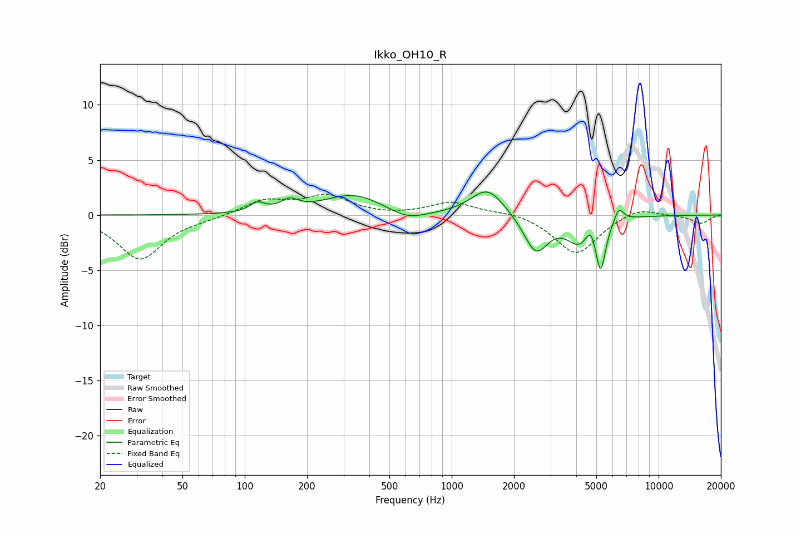

# Ikko_OH10_R
See [usage instructions](https://github.com/jaakkopasanen/AutoEq#usage) for more options and info.

### Parametric EQs
Apply preamp of -2.2 dB when using parametric equalizer.

|   # | Type    |   Fc (Hz) |    Q |   Gain (dB) |
|-----|---------|-----------|------|-------------|
|   1 | Peaking |       115 | 3.97 |         0.8 |
|   2 | Peaking |       165 | 3.31 |         0.9 |
|   3 | Peaking |       336 | 0.96 |         1.9 |
|   4 | Peaking |       609 | 1.54 |        -0.9 |
|   5 | Peaking |      1492 | 1.76 |         2.5 |
|   6 | Peaking |      2555 | 2.45 |        -3.4 |
|   7 | Peaking |      4140 | 2.29 |        -2.3 |
|   8 | Peaking |      4708 | 5.62 |         1.4 |
|   9 | Peaking |      5243 | 5.85 |        -4.5 |
|  10 | Peaking |      6425 | 6    |         1.3 |

### Fixed Band EQs
When using fixed band (also called graphic) equalizer, apply preamp of **-2.0 dB** (if available) and set gains manually with these parameters.

|   # | Type    |   Fc (Hz) |    Q |   Gain (dB) |
|-----|---------|-----------|------|-------------|
|   1 | Peaking |        31 | 1.41 |        -4   |
|   2 | Peaking |        62 | 1.41 |        -0.3 |
|   3 | Peaking |       125 | 1.41 |         1.3 |
|   4 | Peaking |       250 | 1.41 |         1.7 |
|   5 | Peaking |       500 | 1.41 |        -0.1 |
|   6 | Peaking |      1000 | 1.41 |         1.2 |
|   7 | Peaking |      2000 | 1.41 |         0.3 |
|   8 | Peaking |      4000 | 1.41 |        -3.6 |
|   9 | Peaking |      8000 | 1.41 |         0.8 |
|  10 | Peaking |     16000 | 1.41 |        -0.7 |

### Graphs

