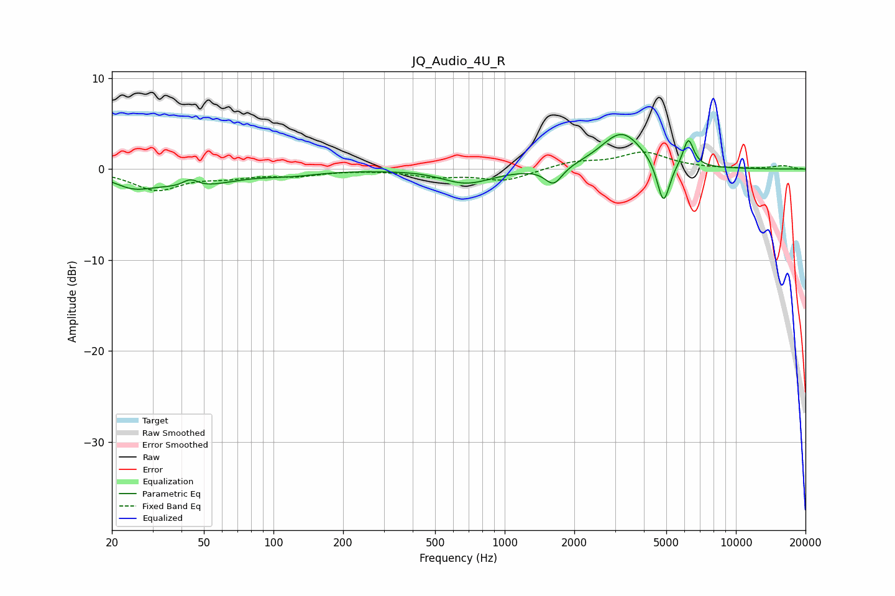

# JQ_Audio_4U_R
See [usage instructions](https://github.com/jaakkopasanen/AutoEq#usage) for more options and info.

### Parametric EQs
Apply preamp of -3.9 dB when using parametric equalizer.

|   # | Type    |   Fc (Hz) |    Q |   Gain (dB) |
|-----|---------|-----------|------|-------------|
|   1 | Peaking |        25 | 1.67 |        -1.4 |
|   2 | Peaking |        44 | 4.09 |         1   |
|   3 | Peaking |        45 | 0.89 |        -1.8 |
|   4 | Peaking |       119 | 1.22 |        -0.4 |
|   5 | Peaking |       447 | 1.39 |         0.1 |
|   6 | Peaking |       682 | 1.26 |        -1.6 |
|   7 | Peaking |      1628 | 3.82 |        -1.9 |
|   8 | Peaking |      3213 | 1.54 |         4.1 |
|   9 | Peaking |      4860 | 5.14 |        -4.9 |
|  10 | Peaking |      6228 | 6    |         3.1 |

### Fixed Band EQs
When using fixed band (also called graphic) equalizer, apply preamp of **-2.0 dB** (if available) and set gains manually with these parameters.

|   # | Type    |   Fc (Hz) |    Q |   Gain (dB) |
|-----|---------|-----------|------|-------------|
|   1 | Peaking |        31 | 1.41 |        -2.2 |
|   2 | Peaking |        62 | 1.41 |        -0.7 |
|   3 | Peaking |       125 | 1.41 |        -0.6 |
|   4 | Peaking |       250 | 1.41 |        -0   |
|   5 | Peaking |       500 | 1.41 |        -0.7 |
|   6 | Peaking |      1000 | 1.41 |        -1.2 |
|   7 | Peaking |      2000 | 1.41 |         0.8 |
|   8 | Peaking |      4000 | 1.41 |         1.8 |
|   9 | Peaking |      8000 | 1.41 |         0   |
|  10 | Peaking |     16000 | 1.41 |         0.4 |

### Graphs

