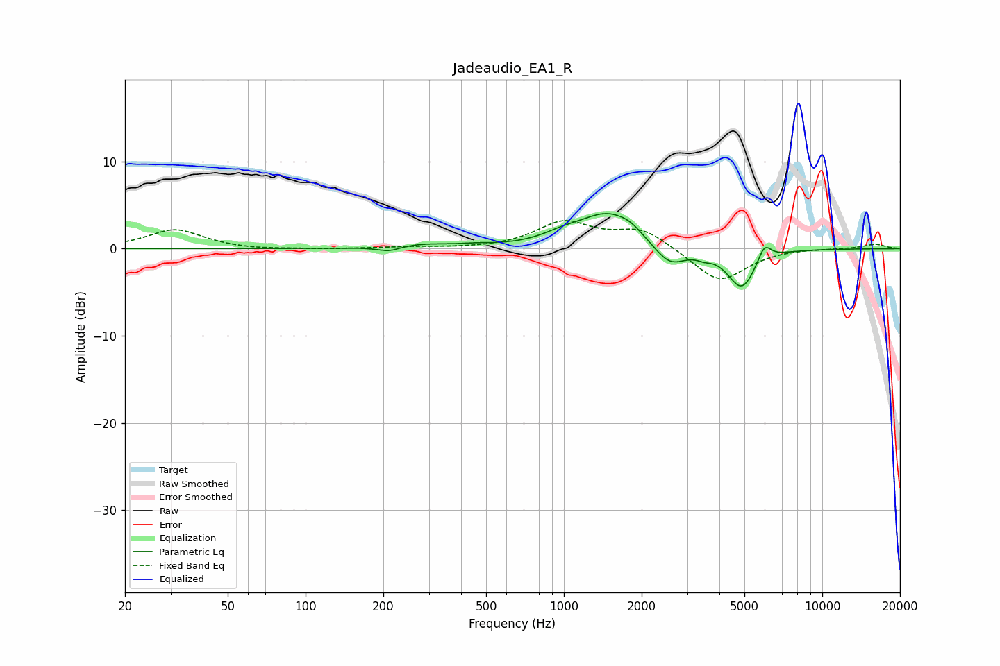

# Jadeaudio_EA1_R
See [usage instructions](https://github.com/jaakkopasanen/AutoEq#usage) for more options and info.

### Parametric EQs
Apply preamp of -4.1 dB when using parametric equalizer.

|   # | Type    |   Fc (Hz) |    Q |   Gain (dB) |
|-----|---------|-----------|------|-------------|
|   1 | Peaking |       210 | 3.34 |        -0.6 |
|   2 | Peaking |       284 | 1.3  |         0.5 |
|   3 | Peaking |       456 | 2.47 |         0.2 |
|   4 | Peaking |       986 | 1.88 |         0.8 |
|   5 | Peaking |      1486 | 1.24 |         4   |
|   6 | Peaking |      1808 | 3.33 |         0.5 |
|   7 | Peaking |      2564 | 2.28 |        -2.5 |
|   8 | Peaking |      3491 | 5.42 |        -0.4 |
|   9 | Peaking |      4882 | 2.54 |        -4.6 |
|  10 | Peaking |      5976 | 5.45 |         2   |

### Fixed Band EQs
When using fixed band (also called graphic) equalizer, apply preamp of **-3.3 dB** (if available) and set gains manually with these parameters.

|   # | Type    |   Fc (Hz) |    Q |   Gain (dB) |
|-----|---------|-----------|------|-------------|
|   1 | Peaking |        31 | 1.41 |         2.2 |
|   2 | Peaking |        62 | 1.41 |        -0.2 |
|   3 | Peaking |       125 | 1.41 |        -0.1 |
|   4 | Peaking |       250 | 1.41 |         0.2 |
|   5 | Peaking |       500 | 1.41 |        -0   |
|   6 | Peaking |      1000 | 1.41 |         2.9 |
|   7 | Peaking |      2000 | 1.41 |         2.2 |
|   8 | Peaking |      4000 | 1.41 |        -3.9 |
|   9 | Peaking |      8000 | 1.41 |         0.1 |
|  10 | Peaking |     16000 | 1.41 |         0.5 |

### Graphs

