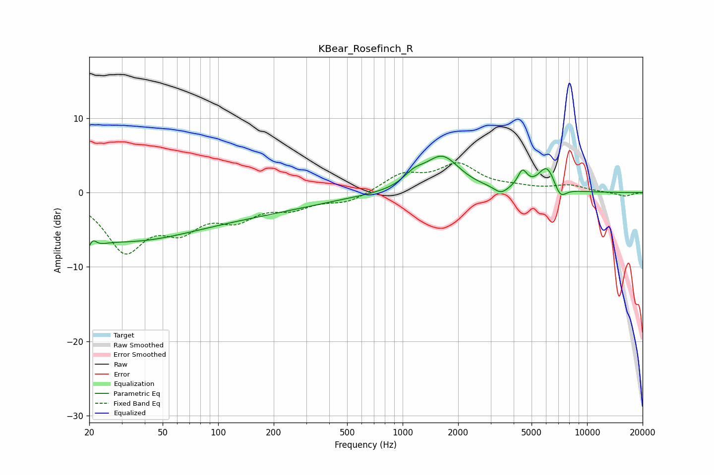

# KBear_Rosefinch_R
See [usage instructions](https://github.com/jaakkopasanen/AutoEq#usage) for more options and info.

### Parametric EQs
Apply preamp of -5.0 dB when using parametric equalizer.

|   # | Type    |   Fc (Hz) |    Q |   Gain (dB) |
|-----|---------|-----------|------|-------------|
|   1 | Peaking |        20 | 3.44 |        -4.7 |
|   2 | Peaking |        21 | 5.46 |         3.4 |
|   3 | Peaking |        28 | 0.41 |        -5.2 |
|   4 | Peaking |       115 | 0.31 |        -2.6 |
|   5 | Peaking |      1149 | 2.5  |         1.4 |
|   6 | Peaking |      1639 | 1.48 |         4.7 |
|   7 | Peaking |      3409 | 3.91 |        -1   |
|   8 | Peaking |      4461 | 5.49 |         2.2 |
|   9 | Peaking |      6060 | 2.9  |         3.4 |
|  10 | Peaking |      7136 | 4.05 |        -1.8 |

### Fixed Band EQs
When using fixed band (also called graphic) equalizer, apply preamp of **-4.1 dB** (if available) and set gains manually with these parameters.

|   # | Type    |   Fc (Hz) |    Q |   Gain (dB) |
|-----|---------|-----------|------|-------------|
|   1 | Peaking |        31 | 1.41 |        -7.4 |
|   2 | Peaking |        62 | 1.41 |        -4   |
|   3 | Peaking |       125 | 1.41 |        -3   |
|   4 | Peaking |       250 | 1.41 |        -1.7 |
|   5 | Peaking |       500 | 1.41 |        -1.3 |
|   6 | Peaking |      1000 | 1.41 |         2.3 |
|   7 | Peaking |      2000 | 1.41 |         3.5 |
|   8 | Peaking |      4000 | 1.41 |         0.5 |
|   9 | Peaking |      8000 | 1.41 |         0.9 |
|  10 | Peaking |     16000 | 1.41 |        -0.5 |

### Graphs

