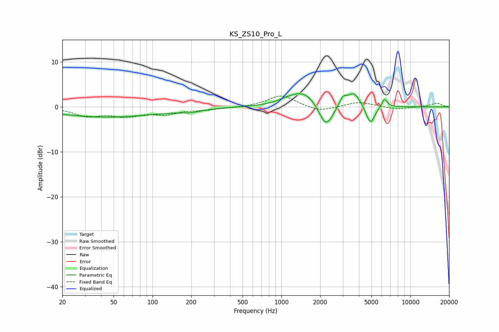

# KS_ZS10_Pro_L
See [usage instructions](https://github.com/jaakkopasanen/AutoEq#usage) for more options and info.

### Parametric EQs
Apply preamp of -3.0 dB when using parametric equalizer.

|   # | Type    |   Fc (Hz) |    Q |   Gain (dB) |
|-----|---------|-----------|------|-------------|
|   1 | Peaking |        45 | 0.34 |        -2.2 |
|   2 | Peaking |       197 | 1.69 |        -0.6 |
|   3 | Peaking |      1108 | 1.68 |         0.6 |
|   4 | Peaking |      1488 | 1.36 |         3.2 |
|   5 | Peaking |      2173 | 2.82 |        -4.4 |
|   6 | Peaking |      2383 | 3.36 |        -1.2 |
|   7 | Peaking |      2998 | 5.46 |         1.8 |
|   8 | Peaking |      3646 | 2.73 |         3.2 |
|   9 | Peaking |      4905 | 4.03 |        -4.2 |
|  10 | Peaking |      6304 | 6    |         2   |

### Fixed Band EQs
When using fixed band (also called graphic) equalizer, apply preamp of **-2.5 dB** (if available) and set gains manually with these parameters.

|   # | Type    |   Fc (Hz) |    Q |   Gain (dB) |
|-----|---------|-----------|------|-------------|
|   1 | Peaking |        31 | 1.41 |        -1.9 |
|   2 | Peaking |        62 | 1.41 |        -1.8 |
|   3 | Peaking |       125 | 1.41 |        -1.4 |
|   4 | Peaking |       250 | 1.41 |        -0.5 |
|   5 | Peaking |       500 | 1.41 |        -0.1 |
|   6 | Peaking |      1000 | 1.41 |         2.6 |
|   7 | Peaking |      2000 | 1.41 |        -1.1 |
|   8 | Peaking |      4000 | 1.41 |         1.1 |
|   9 | Peaking |      8000 | 1.41 |        -0.6 |
|  10 | Peaking |     16000 | 1.41 |         0.8 |

### Graphs

