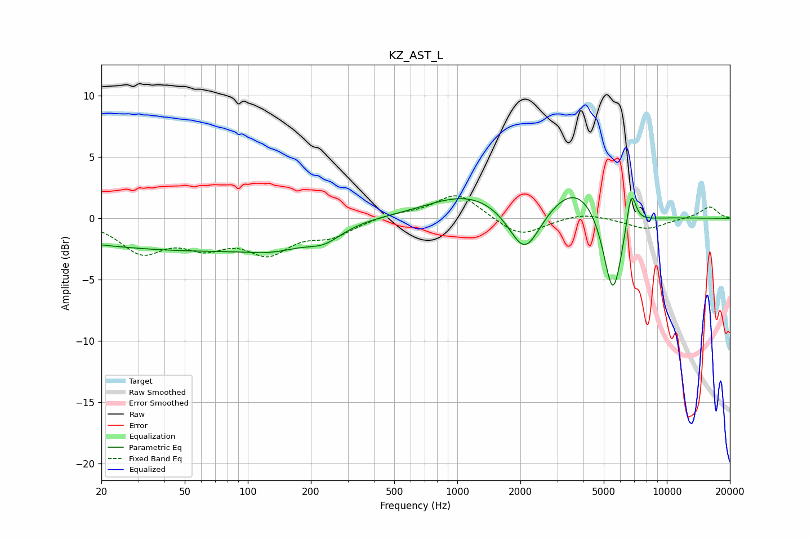

# KZ_AST_L
See [usage instructions](https://github.com/jaakkopasanen/AutoEq#usage) for more options and info.

### Parametric EQs
Apply preamp of -1.8 dB when using parametric equalizer.

|   # | Type    |   Fc (Hz) |    Q |   Gain (dB) |
|-----|---------|-----------|------|-------------|
|   1 | Peaking |        37 | 0.2  |        -2.1 |
|   2 | Peaking |        68 | 0.39 |        -0.5 |
|   3 | Peaking |       134 | 1.07 |        -0.8 |
|   4 | Peaking |       231 | 1.69 |        -1   |
|   5 | Peaking |       339 | 0.97 |         0.2 |
|   6 | Peaking |      1143 | 0.7  |         2   |
|   7 | Peaking |      2098 | 1.86 |        -4.1 |
|   8 | Peaking |      3730 | 1.05 |         2.9 |
|   9 | Peaking |      5528 | 3    |        -7.4 |
|  10 | Peaking |      6756 | 5.84 |         3.3 |

### Fixed Band EQs
When using fixed band (also called graphic) equalizer, apply preamp of **-1.9 dB** (if available) and set gains manually with these parameters.

|   # | Type    |   Fc (Hz) |    Q |   Gain (dB) |
|-----|---------|-----------|------|-------------|
|   1 | Peaking |        31 | 1.41 |        -2.6 |
|   2 | Peaking |        62 | 1.41 |        -1.9 |
|   3 | Peaking |       125 | 1.41 |        -2.5 |
|   4 | Peaking |       250 | 1.41 |        -1.3 |
|   5 | Peaking |       500 | 1.41 |         0.4 |
|   6 | Peaking |      1000 | 1.41 |         2.1 |
|   7 | Peaking |      2000 | 1.41 |        -1.6 |
|   8 | Peaking |      4000 | 1.41 |         0.5 |
|   9 | Peaking |      8000 | 1.41 |        -0.9 |
|  10 | Peaking |     16000 | 1.41 |         1   |

### Graphs

