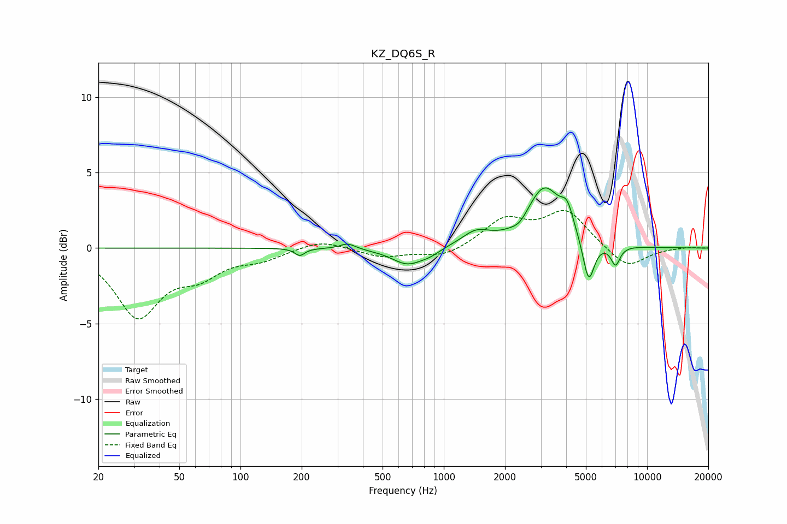

# KZ_DQ6S_R
See [usage instructions](https://github.com/jaakkopasanen/AutoEq#usage) for more options and info.

### Parametric EQs
Apply preamp of -4.1 dB when using parametric equalizer.

|   # | Type    |   Fc (Hz) |    Q |   Gain (dB) |
|-----|---------|-----------|------|-------------|
|   1 | Peaking |       196 | 5.99 |        -0.5 |
|   2 | Peaking |       337 | 3.71 |         0.4 |
|   3 | Peaking |       664 | 1.78 |        -1.1 |
|   4 | Peaking |       858 | 2.94 |        -0.3 |
|   5 | Peaking |      1441 | 2    |         0.9 |
|   6 | Peaking |      2362 | 3.86 |        -0.4 |
|   7 | Peaking |      3124 | 1.67 |         3.9 |
|   8 | Peaking |      4046 | 4.63 |         1.4 |
|   9 | Peaking |      5157 | 4.91 |        -2.9 |
|  10 | Peaking |      6992 | 6    |        -1.3 |

### Fixed Band EQs
When using fixed band (also called graphic) equalizer, apply preamp of **-2.6 dB** (if available) and set gains manually with these parameters.

|   # | Type    |   Fc (Hz) |    Q |   Gain (dB) |
|-----|---------|-----------|------|-------------|
|   1 | Peaking |        31 | 1.41 |        -4.4 |
|   2 | Peaking |        62 | 1.41 |        -1.5 |
|   3 | Peaking |       125 | 1.41 |        -0.6 |
|   4 | Peaking |       250 | 1.41 |         0.6 |
|   5 | Peaking |       500 | 1.41 |        -0.6 |
|   6 | Peaking |      1000 | 1.41 |        -0.6 |
|   7 | Peaking |      2000 | 1.41 |         1.8 |
|   8 | Peaking |      4000 | 1.41 |         2.4 |
|   9 | Peaking |      8000 | 1.41 |        -1.4 |
|  10 | Peaking |     16000 | 1.41 |         0.1 |

### Graphs

