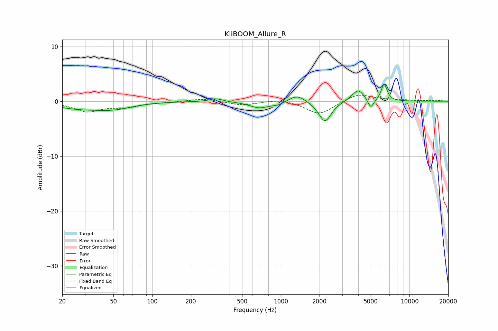

# KiiBOOM_Allure_R
See [usage instructions](https://github.com/jaakkopasanen/AutoEq#usage) for more options and info.

### Parametric EQs
Apply preamp of -3.2 dB when using parametric equalizer.

|   # | Type    |   Fc (Hz) |    Q |   Gain (dB) |
|-----|---------|-----------|------|-------------|
|   1 | Peaking |        27 | 0.72 |        -1.2 |
|   2 | Peaking |        51 | 1.05 |        -1   |
|   3 | Peaking |       313 | 2.93 |         0.6 |
|   4 | Peaking |       682 | 1.82 |        -1.2 |
|   5 | Peaking |       953 | 3.03 |        -0.5 |
|   6 | Peaking |      1341 | 2.23 |         1.3 |
|   7 | Peaking |      2204 | 2.87 |        -3.8 |
|   8 | Peaking |      3991 | 2.95 |         2.2 |
|   9 | Peaking |      5005 | 6    |        -1.8 |
|  10 | Peaking |      6357 | 6    |         3.1 |

### Fixed Band EQs
When using fixed band (also called graphic) equalizer, apply preamp of **-1.2 dB** (if available) and set gains manually with these parameters.

|   # | Type    |   Fc (Hz) |    Q |   Gain (dB) |
|-----|---------|-----------|------|-------------|
|   1 | Peaking |        31 | 1.41 |        -1.8 |
|   2 | Peaking |        62 | 1.41 |        -0.9 |
|   3 | Peaking |       125 | 1.41 |        -0.1 |
|   4 | Peaking |       250 | 1.41 |         0.5 |
|   5 | Peaking |       500 | 1.41 |        -0.7 |
|   6 | Peaking |      1000 | 1.41 |         0.5 |
|   7 | Peaking |      2000 | 1.41 |        -2.5 |
|   8 | Peaking |      4000 | 1.41 |         1.5 |
|   9 | Peaking |      8000 | 1.41 |         0.2 |
|  10 | Peaking |     16000 | 1.41 |         0.2 |

### Graphs

