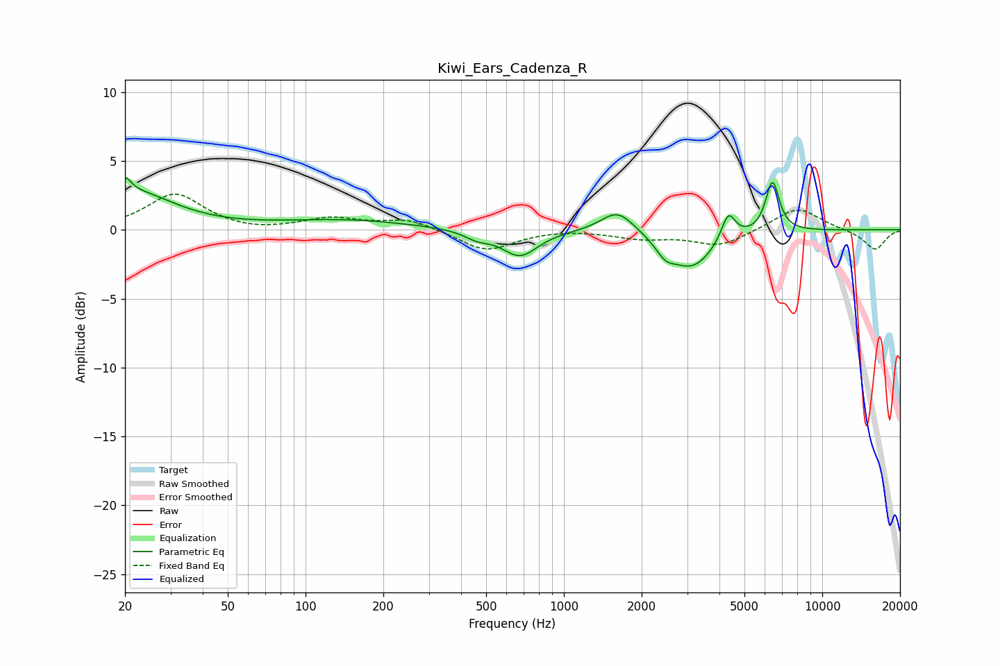

# Kiwi_Ears_Cadenza_R
See [usage instructions](https://github.com/jaakkopasanen/AutoEq#usage) for more options and info.

### Parametric EQs
Apply preamp of -3.9 dB when using parametric equalizer.

|   # | Type    |   Fc (Hz) |    Q |   Gain (dB) |
|-----|---------|-----------|------|-------------|
|   1 | Peaking |        20 | 6    |         1.2 |
|   2 | Peaking |        22 | 0.9  |         2.6 |
|   3 | Peaking |       143 | 0.56 |         0.7 |
|   4 | Peaking |       461 | 2.86 |        -0.5 |
|   5 | Peaking |       676 | 2.03 |        -1.9 |
|   6 | Peaking |      1614 | 2.18 |         1.6 |
|   7 | Peaking |      2472 | 3.73 |        -1   |
|   8 | Peaking |      3133 | 1.63 |        -2.7 |
|   9 | Peaking |      4331 | 5.22 |         2   |
|  10 | Peaking |      6417 | 5.23 |         3.7 |

### Fixed Band EQs
When using fixed band (also called graphic) equalizer, apply preamp of **-2.7 dB** (if available) and set gains manually with these parameters.

|   # | Type    |   Fc (Hz) |    Q |   Gain (dB) |
|-----|---------|-----------|------|-------------|
|   1 | Peaking |        31 | 1.41 |         2.6 |
|   2 | Peaking |        62 | 1.41 |        -0.2 |
|   3 | Peaking |       125 | 1.41 |         0.8 |
|   4 | Peaking |       250 | 1.41 |         0.8 |
|   5 | Peaking |       500 | 1.41 |        -1.5 |
|   6 | Peaking |      1000 | 1.41 |         0.1 |
|   7 | Peaking |      2000 | 1.41 |        -0.6 |
|   8 | Peaking |      4000 | 1.41 |        -1.2 |
|   9 | Peaking |      8000 | 1.41 |         1.7 |
|  10 | Peaking |     16000 | 1.41 |        -1.5 |

### Graphs

