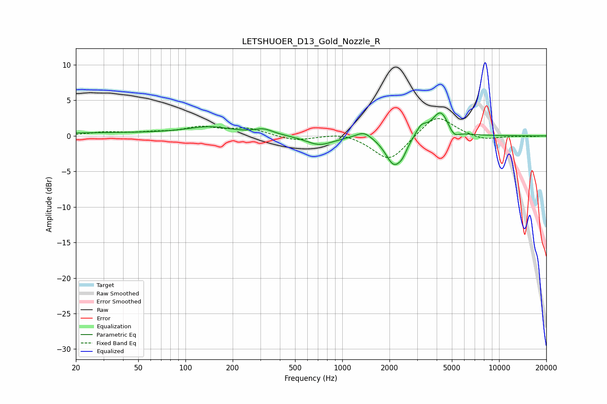

# LETSHUOER_D13_Gold_Nozzle_R
See [usage instructions](https://github.com/jaakkopasanen/AutoEq#usage) for more options and info.

### Parametric EQs
Apply preamp of -3.3 dB when using parametric equalizer.

|   # | Type    |   Fc (Hz) |    Q |   Gain (dB) |
|-----|---------|-----------|------|-------------|
|   1 | Peaking |        39 | 0.18 |         0.4 |
|   2 | Peaking |       144 | 1.01 |         1   |
|   3 | Peaking |       316 | 2.37 |         0.7 |
|   4 | Peaking |       715 | 1.64 |        -1.3 |
|   5 | Peaking |      1373 | 2.89 |         1   |
|   6 | Peaking |      2132 | 2.66 |        -4   |
|   7 | Peaking |      2422 | 4.89 |        -1.1 |
|   8 | Peaking |      3190 | 4.13 |         1.3 |
|   9 | Peaking |      4242 | 2.61 |         3.6 |
|  10 | Peaking |      5131 | 4.1  |        -1.2 |

### Fixed Band EQs
When using fixed band (also called graphic) equalizer, apply preamp of **-2.5 dB** (if available) and set gains manually with these parameters.

|   # | Type    |   Fc (Hz) |    Q |   Gain (dB) |
|-----|---------|-----------|------|-------------|
|   1 | Peaking |        31 | 1.41 |         0.5 |
|   2 | Peaking |        62 | 1.41 |         0.4 |
|   3 | Peaking |       125 | 1.41 |         1.1 |
|   4 | Peaking |       250 | 1.41 |         1   |
|   5 | Peaking |       500 | 1.41 |        -0.7 |
|   6 | Peaking |      1000 | 1.41 |         0.6 |
|   7 | Peaking |      2000 | 1.41 |        -3.6 |
|   8 | Peaking |      4000 | 1.41 |         3.1 |
|   9 | Peaking |      8000 | 1.41 |        -0.7 |
|  10 | Peaking |     16000 | 1.41 |        -0.1 |

### Graphs

