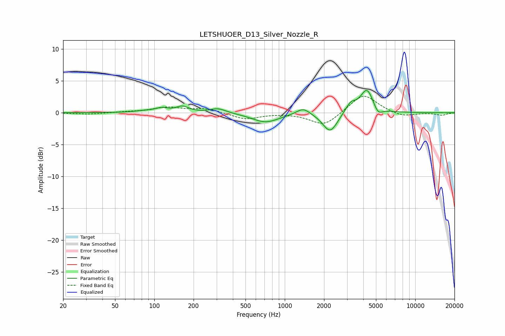

# LETSHUOER_D13_Silver_Nozzle_R
See [usage instructions](https://github.com/jaakkopasanen/AutoEq#usage) for more options and info.

### Parametric EQs
Apply preamp of -3.6 dB when using parametric equalizer.

|   # | Type    |   Fc (Hz) |    Q |   Gain (dB) |
|-----|---------|-----------|------|-------------|
|   1 | Peaking |        86 | 1.78 |         0.2 |
|   2 | Peaking |       114 | 3.04 |         0.6 |
|   3 | Peaking |       164 | 2.97 |         0.9 |
|   4 | Peaking |       308 | 2.27 |         0.7 |
|   5 | Peaking |       713 | 1.37 |        -1.5 |
|   6 | Peaking |      1385 | 2.73 |         1.1 |
|   7 | Peaking |      2229 | 2.51 |        -3.1 |
|   8 | Peaking |      3200 | 3.52 |         1.5 |
|   9 | Peaking |      4266 | 2.85 |         3.7 |
|  10 | Peaking |      5184 | 4.31 |        -1.2 |

### Fixed Band EQs
When using fixed band (also called graphic) equalizer, apply preamp of **-2.7 dB** (if available) and set gains manually with these parameters.

|   # | Type    |   Fc (Hz) |    Q |   Gain (dB) |
|-----|---------|-----------|------|-------------|
|   1 | Peaking |        31 | 1.41 |        -0.2 |
|   2 | Peaking |        62 | 1.41 |         0.1 |
|   3 | Peaking |       125 | 1.41 |         0.8 |
|   4 | Peaking |       250 | 1.41 |         0.7 |
|   5 | Peaking |       500 | 1.41 |        -1   |
|   6 | Peaking |      1000 | 1.41 |        -0   |
|   7 | Peaking |      2000 | 1.41 |        -2.1 |
|   8 | Peaking |      4000 | 1.41 |         3   |
|   9 | Peaking |      8000 | 1.41 |        -0.7 |
|  10 | Peaking |     16000 | 1.41 |        -0.4 |

### Graphs

