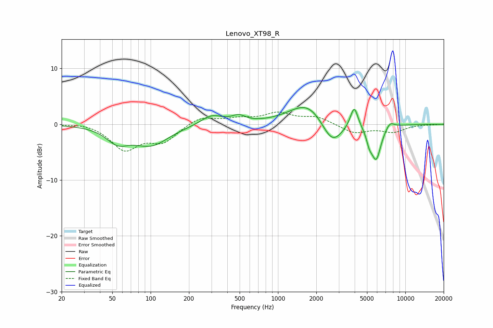

# Lenovo_XT98_R
See [usage instructions](https://github.com/jaakkopasanen/AutoEq#usage) for more options and info.

### Parametric EQs
Apply preamp of -3.1 dB when using parametric equalizer.

|   # | Type    |   Fc (Hz) |    Q |   Gain (dB) |
|-----|---------|-----------|------|-------------|
|   1 | Peaking |        55 | 1.63 |        -2.5 |
|   2 | Peaking |       101 | 1    |        -3.5 |
|   3 | Peaking |       302 | 1.65 |         1.7 |
|   4 | Peaking |       492 | 2.66 |         1.1 |
|   5 | Peaking |      1724 | 0.99 |         4.2 |
|   6 | Peaking |      2657 | 1.69 |        -4.7 |
|   7 | Peaking |      3965 | 4.63 |         4   |
|   8 | Peaking |      5222 | 6    |        -1.9 |
|   9 | Peaking |      5902 | 3.57 |        -6.1 |
|  10 | Peaking |      7564 | 4.11 |         1.1 |

### Fixed Band EQs
When using fixed band (also called graphic) equalizer, apply preamp of **-2.3 dB** (if available) and set gains manually with these parameters.

|   # | Type    |   Fc (Hz) |    Q |   Gain (dB) |
|-----|---------|-----------|------|-------------|
|   1 | Peaking |        31 | 1.41 |         0.4 |
|   2 | Peaking |        62 | 1.41 |        -4.4 |
|   3 | Peaking |       125 | 1.41 |        -2.9 |
|   4 | Peaking |       250 | 1.41 |         1.5 |
|   5 | Peaking |       500 | 1.41 |         0.8 |
|   6 | Peaking |      1000 | 1.41 |         1.9 |
|   7 | Peaking |      2000 | 1.41 |         1.3 |
|   8 | Peaking |      4000 | 1.41 |        -1.6 |
|   9 | Peaking |      8000 | 1.41 |        -1.3 |
|  10 | Peaking |     16000 | 1.41 |        -0   |

### Graphs

