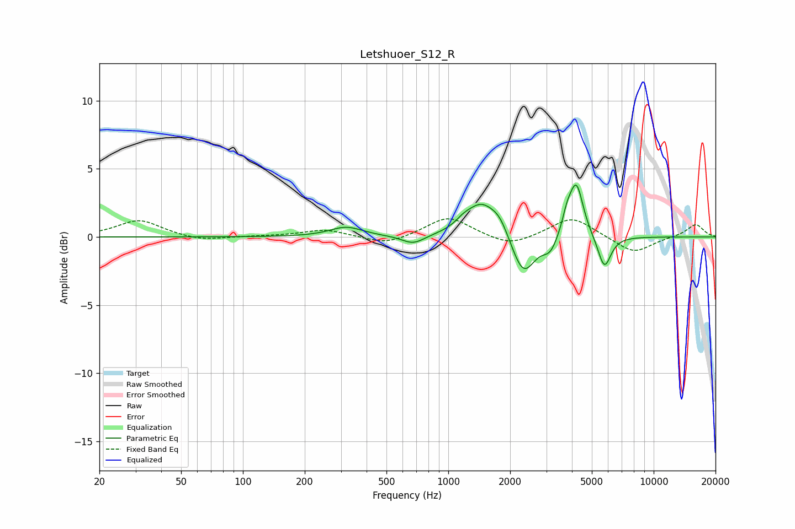

# Letshuoer_S12_R
See [usage instructions](https://github.com/jaakkopasanen/AutoEq#usage) for more options and info.

### Parametric EQs
Apply preamp of -3.9 dB when using parametric equalizer.

|   # | Type    |   Fc (Hz) |    Q |   Gain (dB) |
|-----|---------|-----------|------|-------------|
|   1 | Peaking |       318 | 1.8  |         0.7 |
|   2 | Peaking |       675 | 2.54 |        -0.7 |
|   3 | Peaking |      1183 | 3.71 |         0.4 |
|   4 | Peaking |      1449 | 1.89 |         2.4 |
|   5 | Peaking |      1782 | 3.22 |         1   |
|   6 | Peaking |      2318 | 2.49 |        -3   |
|   7 | Peaking |      3139 | 3.93 |        -1.1 |
|   8 | Peaking |      3782 | 6    |         1.1 |
|   9 | Peaking |      4202 | 4.13 |         3.9 |
|  10 | Peaking |      5756 | 4.39 |        -2.4 |

### Fixed Band EQs
When using fixed band (also called graphic) equalizer, apply preamp of **-1.4 dB** (if available) and set gains manually with these parameters.

|   # | Type    |   Fc (Hz) |    Q |   Gain (dB) |
|-----|---------|-----------|------|-------------|
|   1 | Peaking |        31 | 1.41 |         1.2 |
|   2 | Peaking |        62 | 1.41 |        -0.3 |
|   3 | Peaking |       125 | 1.41 |         0   |
|   4 | Peaking |       250 | 1.41 |         0.5 |
|   5 | Peaking |       500 | 1.41 |        -0.6 |
|   6 | Peaking |      1000 | 1.41 |         1.5 |
|   7 | Peaking |      2000 | 1.41 |        -0.8 |
|   8 | Peaking |      4000 | 1.41 |         1.5 |
|   9 | Peaking |      8000 | 1.41 |        -1.2 |
|  10 | Peaking |     16000 | 1.41 |         0.9 |

### Graphs

