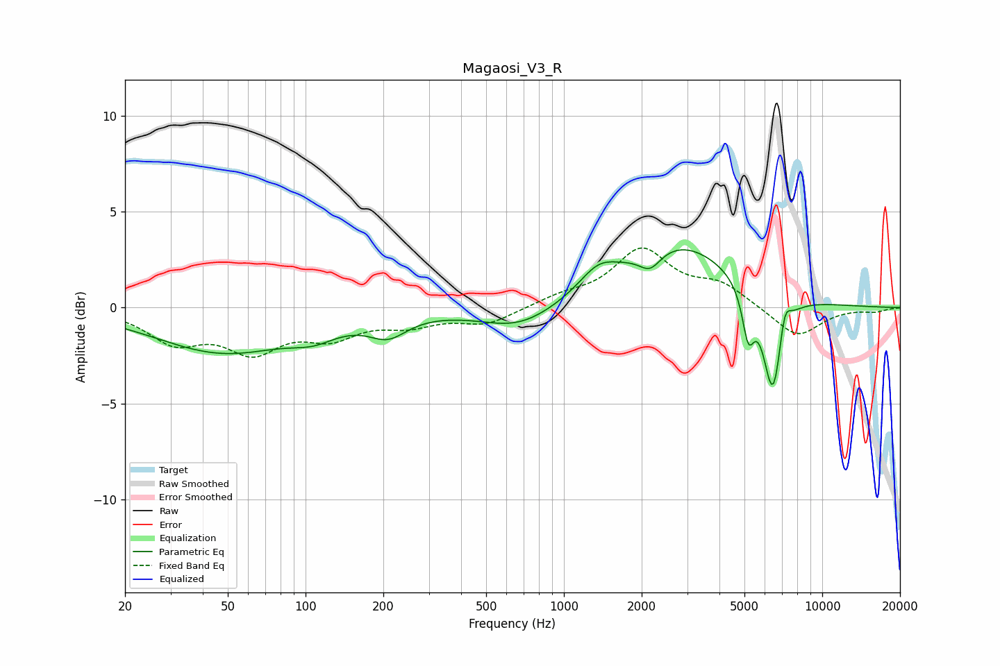

# Magaosi_V3_R
See [usage instructions](https://github.com/jaakkopasanen/AutoEq#usage) for more options and info.

### Parametric EQs
Apply preamp of -3.1 dB when using parametric equalizer.

|   # | Type    |   Fc (Hz) |    Q |   Gain (dB) |
|-----|---------|-----------|------|-------------|
|   1 | Peaking |        48 | 0.53 |        -2.3 |
|   2 | Peaking |       107 | 1.6  |        -0.7 |
|   3 | Peaking |       208 | 1.91 |        -1.1 |
|   4 | Peaking |       672 | 0.95 |        -1.2 |
|   5 | Peaking |      1358 | 1.93 |         1.1 |
|   6 | Peaking |      2157 | 3.33 |        -1   |
|   7 | Peaking |      2784 | 0.65 |         3.3 |
|   8 | Peaking |      5174 | 6    |        -2.5 |
|   9 | Peaking |      6450 | 3.67 |        -5.5 |
|  10 | Peaking |      7134 | 6    |         1.7 |

### Fixed Band EQs
When using fixed band (also called graphic) equalizer, apply preamp of **-3.2 dB** (if available) and set gains manually with these parameters.

|   # | Type    |   Fc (Hz) |    Q |   Gain (dB) |
|-----|---------|-----------|------|-------------|
|   1 | Peaking |        31 | 1.41 |        -1.6 |
|   2 | Peaking |        62 | 1.41 |        -2   |
|   3 | Peaking |       125 | 1.41 |        -1.3 |
|   4 | Peaking |       250 | 1.41 |        -0.8 |
|   5 | Peaking |       500 | 1.41 |        -0.8 |
|   6 | Peaking |      1000 | 1.41 |         0.5 |
|   7 | Peaking |      2000 | 1.41 |         2.9 |
|   8 | Peaking |      4000 | 1.41 |         1.1 |
|   9 | Peaking |      8000 | 1.41 |        -1.6 |
|  10 | Peaking |     16000 | 1.41 |        -0.2 |

### Graphs

