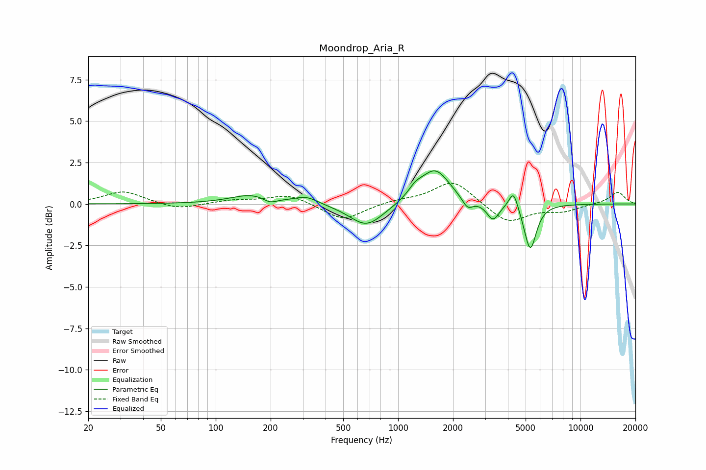

# Moondrop_Aria_R
See [usage instructions](https://github.com/jaakkopasanen/AutoEq#usage) for more options and info.

### Parametric EQs
Apply preamp of -2.1 dB when using parametric equalizer.

|   # | Type    |   Fc (Hz) |    Q |   Gain (dB) |
|-----|---------|-----------|------|-------------|
|   1 | Peaking |       158 | 1.24 |         0.6 |
|   2 | Peaking |       198 | 3.78 |        -0.3 |
|   3 | Peaking |       314 | 2.22 |         0.4 |
|   4 | Peaking |       671 | 1.53 |        -1.4 |
|   5 | Peaking |      1243 | 3.41 |         0.5 |
|   6 | Peaking |      1598 | 1.8  |         2.1 |
|   7 | Peaking |      2403 | 4.83 |        -0.6 |
|   8 | Peaking |      3311 | 4.26 |        -1   |
|   9 | Peaking |      4293 | 5.64 |         1.1 |
|  10 | Peaking |      5301 | 4.22 |        -2.8 |

### Fixed Band EQs
When using fixed band (also called graphic) equalizer, apply preamp of **-1.3 dB** (if available) and set gains manually with these parameters.

|   # | Type    |   Fc (Hz) |    Q |   Gain (dB) |
|-----|---------|-----------|------|-------------|
|   1 | Peaking |        31 | 1.41 |         0.8 |
|   2 | Peaking |        62 | 1.41 |        -0.4 |
|   3 | Peaking |       125 | 1.41 |         0.2 |
|   4 | Peaking |       250 | 1.41 |         0.6 |
|   5 | Peaking |       500 | 1.41 |        -1   |
|   6 | Peaking |      1000 | 1.41 |         0.2 |
|   7 | Peaking |      2000 | 1.41 |         1.4 |
|   8 | Peaking |      4000 | 1.41 |        -1.2 |
|   9 | Peaking |      8000 | 1.41 |        -0.4 |
|  10 | Peaking |     16000 | 1.41 |         0.7 |

### Graphs

