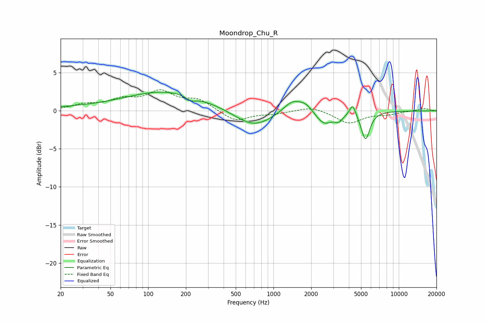

# Moondrop_Chu_R
See [usage instructions](https://github.com/jaakkopasanen/AutoEq#usage) for more options and info.

### Parametric EQs
Apply preamp of -2.6 dB when using parametric equalizer.

|   # | Type    |   Fc (Hz) |    Q |   Gain (dB) |
|-----|---------|-----------|------|-------------|
|   1 | Peaking |        47 | 0.22 |         0.4 |
|   2 | Peaking |       144 | 0.45 |         2.3 |
|   3 | Peaking |       220 | 3.46 |        -0.6 |
|   4 | Peaking |       693 | 0.96 |        -2.2 |
|   5 | Peaking |      1422 | 1.89 |         1.7 |
|   6 | Peaking |      1819 | 2.8  |         0.9 |
|   7 | Peaking |      2536 | 2.15 |        -1.7 |
|   8 | Peaking |      3318 | 4.36 |        -0.9 |
|   9 | Peaking |      4288 | 5.99 |         1.6 |
|  10 | Peaking |      5425 | 4.07 |        -3.7 |

### Fixed Band EQs
When using fixed band (also called graphic) equalizer, apply preamp of **-2.9 dB** (if available) and set gains manually with these parameters.

|   # | Type    |   Fc (Hz) |    Q |   Gain (dB) |
|-----|---------|-----------|------|-------------|
|   1 | Peaking |        31 | 1.41 |         0.7 |
|   2 | Peaking |        62 | 1.41 |         1.3 |
|   3 | Peaking |       125 | 1.41 |         2.3 |
|   4 | Peaking |       250 | 1.41 |         1.4 |
|   5 | Peaking |       500 | 1.41 |        -1.4 |
|   6 | Peaking |      1000 | 1.41 |        -0.3 |
|   7 | Peaking |      2000 | 1.41 |         0.6 |
|   8 | Peaking |      4000 | 1.41 |        -1.6 |
|   9 | Peaking |      8000 | 1.41 |        -0.4 |
|  10 | Peaking |     16000 | 1.41 |         0.3 |

### Graphs

