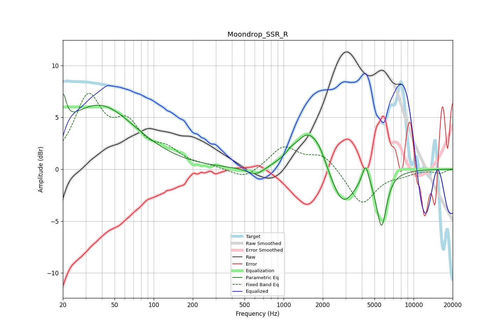

# Moondrop_SSR_R
See [usage instructions](https://github.com/jaakkopasanen/AutoEq#usage) for more options and info.

### Parametric EQs
Apply preamp of -7.4 dB when using parametric equalizer.

|   # | Type    |   Fc (Hz) |    Q |   Gain (dB) |
|-----|---------|-----------|------|-------------|
|   1 | Peaking |        20 | 5.92 |         3.1 |
|   2 | Peaking |        38 | 0.5  |         6.1 |
|   3 | Peaking |       610 | 2.11 |        -0.8 |
|   4 | Peaking |      1023 | 4.74 |        -0.3 |
|   5 | Peaking |      1091 | 2.55 |         0.8 |
|   6 | Peaking |      1547 | 1.52 |         3.5 |
|   7 | Peaking |      1903 | 2.76 |         0.9 |
|   8 | Peaking |      2851 | 1.58 |        -3.6 |
|   9 | Peaking |      4268 | 5.58 |         2   |
|  10 | Peaking |      5667 | 3.65 |        -5.2 |

### Fixed Band EQs
When using fixed band (also called graphic) equalizer, apply preamp of **-7.4 dB** (if available) and set gains manually with these parameters.

|   # | Type    |   Fc (Hz) |    Q |   Gain (dB) |
|-----|---------|-----------|------|-------------|
|   1 | Peaking |        31 | 1.41 |         6.6 |
|   2 | Peaking |        62 | 1.41 |         3.5 |
|   3 | Peaking |       125 | 1.41 |         1.5 |
|   4 | Peaking |       250 | 1.41 |         0.2 |
|   5 | Peaking |       500 | 1.41 |        -1   |
|   6 | Peaking |      1000 | 1.41 |         2.2 |
|   7 | Peaking |      2000 | 1.41 |         1.5 |
|   8 | Peaking |      4000 | 1.41 |        -3.4 |
|   9 | Peaking |      8000 | 1.41 |        -0.4 |
|  10 | Peaking |     16000 | 1.41 |        -0.4 |

### Graphs

