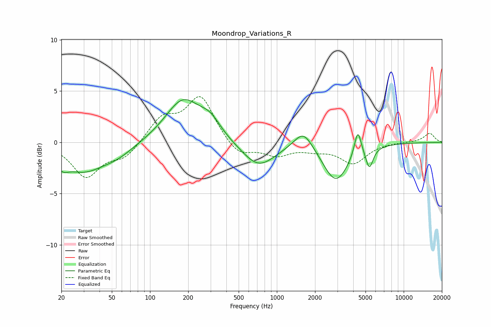

# Moondrop_Variations_R
See [usage instructions](https://github.com/jaakkopasanen/AutoEq#usage) for more options and info.

### Parametric EQs
Apply preamp of -4.3 dB when using parametric equalizer.

|   # | Type    |   Fc (Hz) |    Q |   Gain (dB) |
|-----|---------|-----------|------|-------------|
|   1 | Peaking |        20 | 2.88 |        -1   |
|   2 | Peaking |        30 | 0.87 |        -2.5 |
|   3 | Peaking |        55 | 1.04 |        -1   |
|   4 | Peaking |       182 | 1.02 |         4.1 |
|   5 | Peaking |       299 | 1.71 |         1.4 |
|   6 | Peaking |       716 | 1.1  |        -2.4 |
|   7 | Peaking |      1619 | 1.95 |         1.9 |
|   8 | Peaking |      2916 | 1.42 |        -3.8 |
|   9 | Peaking |      4344 | 5.22 |         2.6 |
|  10 | Peaking |      5366 | 4.83 |        -2   |

### Fixed Band EQs
When using fixed band (also called graphic) equalizer, apply preamp of **-4.6 dB** (if available) and set gains manually with these parameters.

|   # | Type    |   Fc (Hz) |    Q |   Gain (dB) |
|-----|---------|-----------|------|-------------|
|   1 | Peaking |        31 | 1.41 |        -3.3 |
|   2 | Peaking |        62 | 1.41 |        -1.4 |
|   3 | Peaking |       125 | 1.41 |         2.3 |
|   4 | Peaking |       250 | 1.41 |         4.4 |
|   5 | Peaking |       500 | 1.41 |        -1.4 |
|   6 | Peaking |      1000 | 1.41 |        -1.2 |
|   7 | Peaking |      2000 | 1.41 |        -0.6 |
|   8 | Peaking |      4000 | 1.41 |        -2   |
|   9 | Peaking |      8000 | 1.41 |         0   |
|  10 | Peaking |     16000 | 1.41 |         0.9 |

### Graphs

