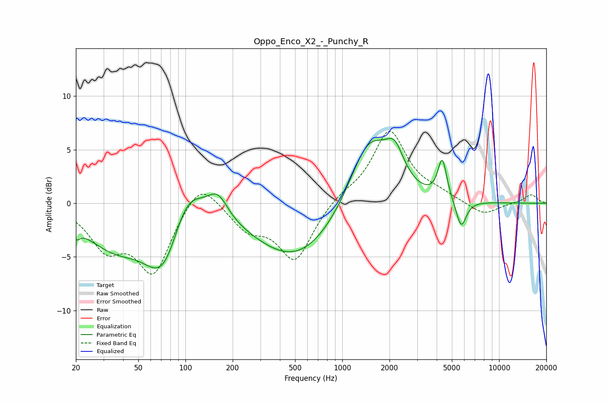

# Oppo_Enco_X2_-_Punchy_R
See [usage instructions](https://github.com/jaakkopasanen/AutoEq#usage) for more options and info.

### Parametric EQs
Apply preamp of -6.1 dB when using parametric equalizer.

|   # | Type    |   Fc (Hz) |    Q |   Gain (dB) |
|-----|---------|-----------|------|-------------|
|   1 | Peaking |        20 | 5.83 |        -1   |
|   2 | Peaking |        35 | 0.72 |        -3.6 |
|   3 | Peaking |        73 | 1.19 |        -6.3 |
|   4 | Peaking |       101 | 1.3  |         4.5 |
|   5 | Peaking |       161 | 2.19 |         2.2 |
|   6 | Peaking |       517 | 0.51 |        -5.3 |
|   7 | Peaking |      1475 | 1.08 |         6.9 |
|   8 | Peaking |      2158 | 2.35 |         3   |
|   9 | Peaking |      4343 | 5.02 |         3.7 |
|  10 | Peaking |      5729 | 4.23 |        -2.6 |

### Fixed Band EQs
When using fixed band (also called graphic) equalizer, apply preamp of **-6.8 dB** (if available) and set gains manually with these parameters.

|   # | Type    |   Fc (Hz) |    Q |   Gain (dB) |
|-----|---------|-----------|------|-------------|
|   1 | Peaking |        31 | 1.41 |        -3.7 |
|   2 | Peaking |        62 | 1.41 |        -6.3 |
|   3 | Peaking |       125 | 1.41 |         2.7 |
|   4 | Peaking |       250 | 1.41 |        -2.2 |
|   5 | Peaking |       500 | 1.41 |        -5.2 |
|   6 | Peaking |      1000 | 1.41 |         0.8 |
|   7 | Peaking |      2000 | 1.41 |         6.7 |
|   8 | Peaking |      4000 | 1.41 |         0.7 |
|   9 | Peaking |      8000 | 1.41 |        -1.2 |
|  10 | Peaking |     16000 | 1.41 |         0.8 |

### Graphs

