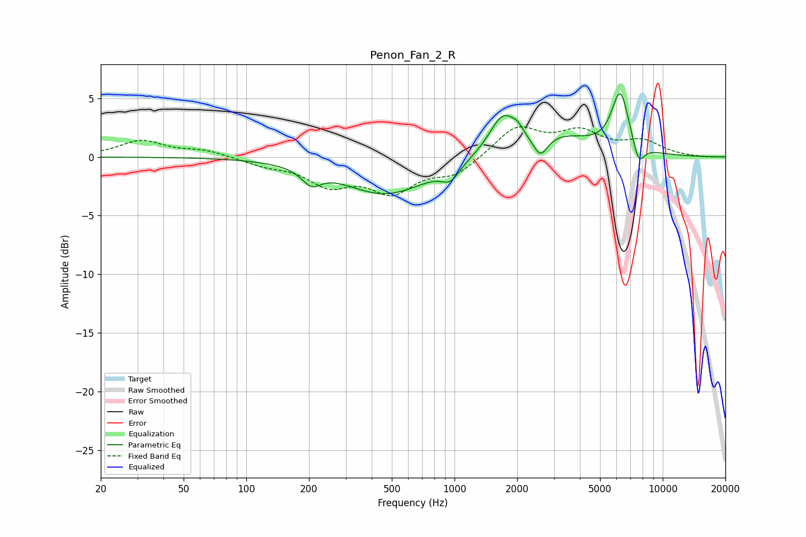

# Penon_Fan_2_R
See [usage instructions](https://github.com/jaakkopasanen/AutoEq#usage) for more options and info.

### Parametric EQs
Apply preamp of -5.5 dB when using parametric equalizer.

|   # | Type    |   Fc (Hz) |    Q |   Gain (dB) |
|-----|---------|-----------|------|-------------|
|   1 | Peaking |       206 | 3.11 |        -1.3 |
|   2 | Peaking |       467 | 0.69 |        -3.2 |
|   3 | Peaking |       956 | 3.59 |         0   |
|   4 | Peaking |       956 | 3.37 |        -1.2 |
|   5 | Peaking |      1715 | 2.1  |         3.4 |
|   6 | Peaking |      2012 | 6    |         0.5 |
|   7 | Peaking |      2585 | 4.08 |        -1.8 |
|   8 | Peaking |      3266 | 0.91 |         1.6 |
|   9 | Peaking |      6259 | 3.26 |         5.1 |
|  10 | Peaking |      7661 | 4.89 |        -1.9 |

### Fixed Band EQs
When using fixed band (also called graphic) equalizer, apply preamp of **-2.7 dB** (if available) and set gains manually with these parameters.

|   # | Type    |   Fc (Hz) |    Q |   Gain (dB) |
|-----|---------|-----------|------|-------------|
|   1 | Peaking |        31 | 1.41 |         1.4 |
|   2 | Peaking |        62 | 1.41 |         0.5 |
|   3 | Peaking |       125 | 1.41 |        -0.6 |
|   4 | Peaking |       250 | 1.41 |        -2.2 |
|   5 | Peaking |       500 | 1.41 |        -2.7 |
|   6 | Peaking |      1000 | 1.41 |        -1.4 |
|   7 | Peaking |      2000 | 1.41 |         2.5 |
|   8 | Peaking |      4000 | 1.41 |         1.9 |
|   9 | Peaking |      8000 | 1.41 |         1.2 |
|  10 | Peaking |     16000 | 1.41 |        -0.1 |

### Graphs

