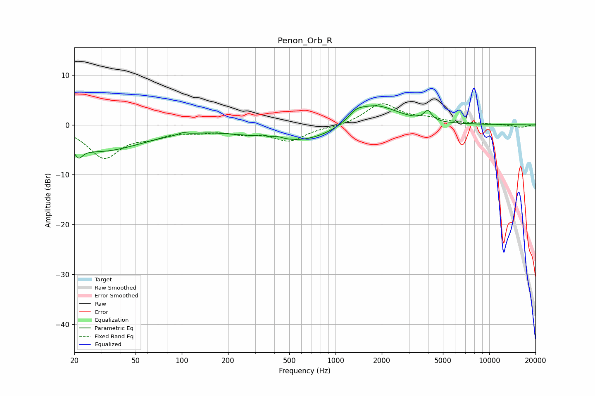

# Penon_Orb_R
See [usage instructions](https://github.com/jaakkopasanen/AutoEq#usage) for more options and info.

### Parametric EQs
Apply preamp of -3.9 dB when using parametric equalizer.

|   # | Type    |   Fc (Hz) |    Q |   Gain (dB) |
|-----|---------|-----------|------|-------------|
|   1 | Peaking |        21 | 5.71 |        -1.9 |
|   2 | Peaking |        29 | 0.48 |        -5.2 |
|   3 | Peaking |       101 | 5.99 |         0.4 |
|   4 | Peaking |       367 | 5.99 |        -0.9 |
|   5 | Peaking |       378 | 3.19 |         2.1 |
|   6 | Peaking |       392 | 6    |        -0.7 |
|   7 | Peaking |       592 | 0.47 |        -3.8 |
|   8 | Peaking |      1363 | 2.89 |         1.3 |
|   9 | Peaking |      1779 | 0.93 |         4.9 |
|  10 | Peaking |      3982 | 5.89 |         2   |

### Fixed Band EQs
When using fixed band (also called graphic) equalizer, apply preamp of **-4.3 dB** (if available) and set gains manually with these parameters.

|   # | Type    |   Fc (Hz) |    Q |   Gain (dB) |
|-----|---------|-----------|------|-------------|
|   1 | Peaking |        31 | 1.41 |        -6.4 |
|   2 | Peaking |        62 | 1.41 |        -1.8 |
|   3 | Peaking |       125 | 1.41 |        -1   |
|   4 | Peaking |       250 | 1.41 |        -1.3 |
|   5 | Peaking |       500 | 1.41 |        -3   |
|   6 | Peaking |      1000 | 1.41 |        -0.4 |
|   7 | Peaking |      2000 | 1.41 |         4.2 |
|   8 | Peaking |      4000 | 1.41 |         1   |
|   9 | Peaking |      8000 | 1.41 |         0.2 |
|  10 | Peaking |     16000 | 1.41 |        -0.5 |

### Graphs

