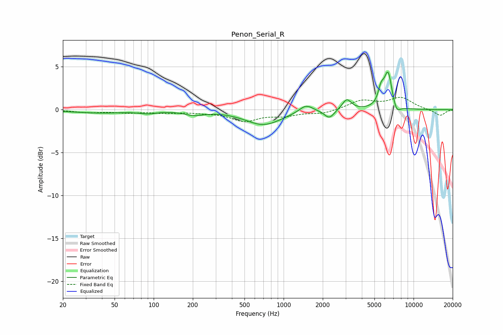

# Penon_Serial_R
See [usage instructions](https://github.com/jaakkopasanen/AutoEq#usage) for more options and info.

### Parametric EQs
Apply preamp of -4.5 dB when using parametric equalizer.

|   # | Type    |   Fc (Hz) |    Q |   Gain (dB) |
|-----|---------|-----------|------|-------------|
|   1 | Peaking |        38 | 0.64 |        -0.4 |
|   2 | Peaking |        91 | 2.24 |        -0.3 |
|   3 | Peaking |       205 | 1.88 |        -0.5 |
|   4 | Peaking |       700 | 1.01 |        -1.7 |
|   5 | Peaking |      1487 | 2.73 |         0.9 |
|   6 | Peaking |      2245 | 3.79 |        -1   |
|   7 | Peaking |      3062 | 4.08 |         1.3 |
|   8 | Peaking |      5626 | 6    |         1.8 |
|   9 | Peaking |      6363 | 4.61 |         4.2 |
|  10 | Peaking |      7402 | 4.85 |        -1   |

### Fixed Band EQs
When using fixed band (also called graphic) equalizer, apply preamp of **-1.5 dB** (if available) and set gains manually with these parameters.

|   # | Type    |   Fc (Hz) |    Q |   Gain (dB) |
|-----|---------|-----------|------|-------------|
|   1 | Peaking |        31 | 1.41 |        -0.3 |
|   2 | Peaking |        62 | 1.41 |        -0.3 |
|   3 | Peaking |       125 | 1.41 |        -0.3 |
|   4 | Peaking |       250 | 1.41 |        -0.2 |
|   5 | Peaking |       500 | 1.41 |        -1.2 |
|   6 | Peaking |      1000 | 1.41 |        -0.6 |
|   7 | Peaking |      2000 | 1.41 |        -0.4 |
|   8 | Peaking |      4000 | 1.41 |         1   |
|   9 | Peaking |      8000 | 1.41 |         1.3 |
|  10 | Peaking |     16000 | 1.41 |        -0.7 |

### Graphs

