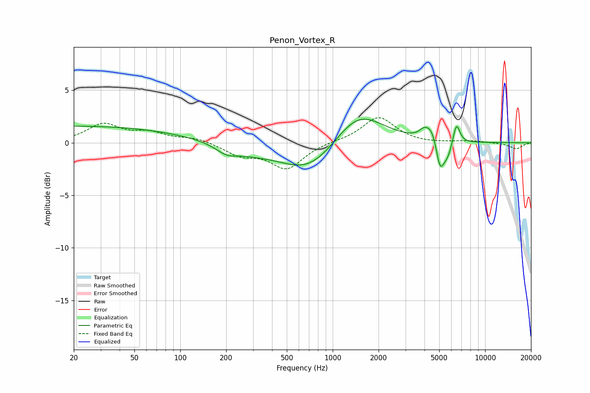

# Penon_Vortex_R
See [usage instructions](https://github.com/jaakkopasanen/AutoEq#usage) for more options and info.

### Parametric EQs
Apply preamp of -2.3 dB when using parametric equalizer.

|   # | Type    |   Fc (Hz) |    Q |   Gain (dB) |
|-----|---------|-----------|------|-------------|
|   1 | Peaking |        20 | 0.18 |         1.6 |
|   2 | Peaking |       202 | 1.91 |        -0.9 |
|   3 | Peaking |       300 | 1.06 |        -0.5 |
|   4 | Peaking |       708 | 0.73 |        -3   |
|   5 | Peaking |      1456 | 0.86 |         3.4 |
|   6 | Peaking |      3954 | 4.71 |         0.5 |
|   7 | Peaking |      4463 | 3.33 |         1.5 |
|   8 | Peaking |      5050 | 5.4  |        -2.6 |
|   9 | Peaking |      5635 | 3.75 |        -1.6 |
|  10 | Peaking |      6478 | 6    |         2.1 |

### Fixed Band EQs
When using fixed band (also called graphic) equalizer, apply preamp of **-2.5 dB** (if available) and set gains manually with these parameters.

|   # | Type    |   Fc (Hz) |    Q |   Gain (dB) |
|-----|---------|-----------|------|-------------|
|   1 | Peaking |        31 | 1.41 |         1.7 |
|   2 | Peaking |        62 | 1.41 |         0.8 |
|   3 | Peaking |       125 | 1.41 |         0.5 |
|   4 | Peaking |       250 | 1.41 |        -1.1 |
|   5 | Peaking |       500 | 1.41 |        -2.4 |
|   6 | Peaking |      1000 | 1.41 |         0.1 |
|   7 | Peaking |      2000 | 1.41 |         2.5 |
|   8 | Peaking |      4000 | 1.41 |        -0.1 |
|   9 | Peaking |      8000 | 1.41 |         0.2 |
|  10 | Peaking |     16000 | 1.41 |        -0.6 |

### Graphs

